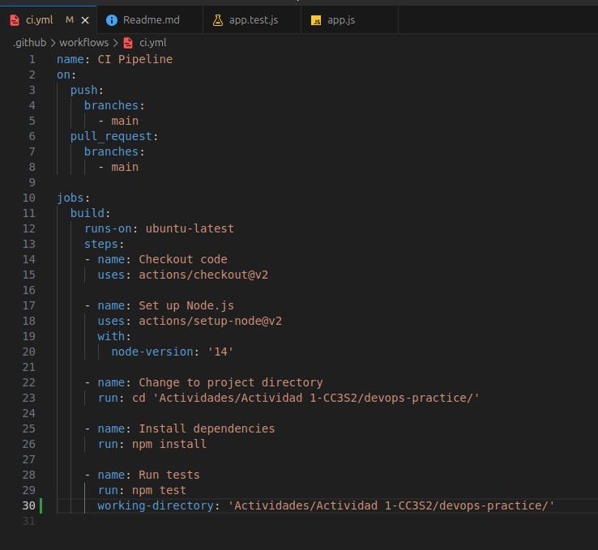
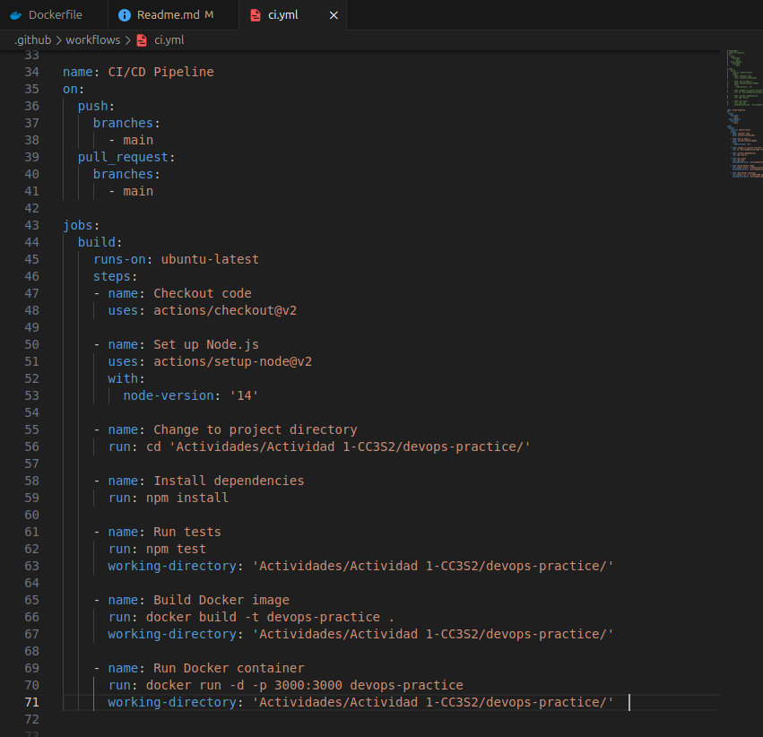

## 1. Lectura y reflexión  
### 1.1 ¿Qué es DevOps?  
El término DevOps es una combinación de Development(Dev) que hace referencia al equipo de desarrollo y Operations(Ops) que hace referencia al equipo de operaciones TI. DevOps mas que ser una metodología, es una *forma* de pensar o mejor dicho una visión de la estructura de la empresa donde tanto el equipo de desarrollo y de operaciones TI ya no son entes separados sino son una misma unidad, un mismo equipo eliminando los "silos".


### 1.2 Historia y antecedentes de DevOps.  
Antes el software era lanzado a los usuarios pero ellos los recibian con errores, y ya no había posibilidad de *actualizar* corrigiendo dichos errores o añadiendo nuevas características, sin embargo surgieron los servidores HTTP de apache y el cambio hacia la comunicacion en red dando esa posibilidad de corregir o añadir algo nuevo al software, pero debido a los silos (barreras entre equipos diferentes) entre el equipo de desarrollo y operaciones TI, estas actualizaciones eran ineficientes y eran hechos con retraso, pues las necesiades del público cambian constantemente y el software requiere muchas actualizaciones, y cuando el equipo de Dev hacia alguna actualización, demoraba en desplegarse, y cuando ya se desplegaba los usuarios ya tenían necesidades distintas, entonces surge una nueva mentalidad, la de DevOps, uniendo a ambos equipos, colaborando como una entidad unificada.

### 1.3 Diferencias entre los equipos de desarrollo y operaciones en el pasado  
-**En su funcionalidad**: los de desarrollo se centrar en crear mejoras o actualizacions al software mientras que los de Operaciones gestionan el entorno de producción.

-**En su objetivo**: Los de desarrollo solo se centraban en añadir nuevas características y que estas pasen sin error, pero los de Operaciones priorizaban la estabilidad del sistema (esto era una contradicción pues al priorizar la estabilidad, puede implicar no aceptar cambios).

### 1.4 Principios fundamentales de DevOps (centrado en el cliente, equipos autónomos y multifuncionales, mejora continua, automatización).  
**-Centrado en el cliente:** Las necesidades del cliente son la mayor prioridad esto acarrea resolver problemas de la vidad real, asi el producto final no solo sea funcioanl, sino también sea valioso y relevante para la audiencia, de nada sirve tener un producto que funciona pero nadie quiere.  
  
**-Equipos autónomos y multifuncionales:** Autónomo hace referencia que el equipo puede tomar decisiones por si mismos si aprobación de otros y multifucionales hace referencia que el equipo esta compuesto por personas con diferentes habilidades,la union de ambos implicaría una agiliadad y eficiencia pues se toman desiciones y trabajan en conjunto.  
  
**Mejora Continua:** Con las mejoras continuas garantizas que el software sea mas confiable ya que hay actualizaciones seguidas y en esas se corrigen errores (a nivel técnico) y a nivel cultural se fomenta un ambiente de aprendizaje grupal pues todos se ayudan entre si.  
  
**Automatización:** Aqui se busca eliminar la realización de tareas manuales (que generan errores y son lentas), para ello se conectan el desarrollo y las operaciones con ayuda de herramientas como CI/CD


### 1.5 Qué NO es DevOps.  
* DevOps NO se trata solo de una herramienta, tecnología o producto.
* DevOps NO se trata de individuos específicos, equipos o roles.
* DevOps NO es solo un proceso.  
  
## 2. Preguntas de reflexión  
  
* **Pregunta 1: ¿Por qué surgió la necesidad de DevOps en el desarrollo de software?**  
Porque con el avanze de las tecnologías el software requiere actualizaciones continuas de una forma rápida, esto requiere un proceso ágil.  
  
* **Pregunta 2: Explica cómo la falta de comunicación y coordinación entre los equipos de desarrollo y operaciones en el pasado ha llevado a la creación de DevOps.**  
Los errores que generaban eran el retraso ya que trabajaban separadamente los equipos, los clientes siempre tienen mas demanda de mejoras, nuevas funcionalidades, errores, y los desarrolladores los hacían pero debido a la falta de comunicacion y coordinacion con el otro equipo de operaciones tardaban en ser desplegados, y para cuando ya lo hacían muy probablenete los clientes solicitaban nuevas actualizaciones, entonces de esto nació una nueva mentalidad que fomentaba la colbaración entre ambos equipos como si fuera uno solo surgiendo asi DevOps.  

* **Pregunta 3: Describe cómo el principio de mejora continua afecta tanto a los aspectos técnicos como culturales de una organización**   
-A nivel técnico: Mejora la confiabilidad pues al ser mas ágiles y efectiva las actualizaciones, en ellas se pueden corregir errores mas rápido, además de qué el software sera mas adaptable a cambios.  
-A nivel cultural: Se promueve un ambiente de aprendizaje y de trabajo colaborativo pues al estár unidos los grupos hay una mejor comunicación-  
  
* **Pregunta 4: ¿Qué significa que DevOps no se trata solo de herramientas, individuos o procesos?**  
-No son herramientas porque el uso de estas no implica saber DevOps, las herramientas son medios de ayuda para hacer efectiva y fácil el DevOps.  
-No son individuos, tener un profesional en DevOps no garantiza que se ejecutará DevOps exitosamente, DevOps implica la colaboración continua de todos, no solo con algún profesional en DevOps.  
-No son procesos, porque DevOps es algo mas grande, es toda una nueva mentalidad de trabajo.  
En resumen entiendo el DevOps como una nueva perspectiva de ver las cosas al momento de trabajar, una nueva mentalidad donde se predomina la particiación e integración de los equipos para agilizar la entrega del software con sus respectivas actualizaciones.  
  
* **Pregunta 5: Según el texto, ¿cómo contribuyen los equipos autónomos y multifuncionales a una implementación exitosa de DevOps?**  
Al tener un equipo multifuncional se reduce el tiempo de pasar de la idea al producto, ya que en un mismo equipo hay miembros con diferentes habilidades pertinentes al desarrollo. Además como los equipos son uno, no hay la necesidad de esperar la aprobación de otro departamente, esto cultiva una cultura de propieadad y responsabilidad.   


# Poniendo en práctica CI/CD
## 1. Configuración del entorno:  
### 1.1 Inicializamos el proyecto de Node.js:  
Creamos un archivo donde realizaremos el trabajo y sobre ella creamos un package.json
  
  
### 1.2 Instalar las dependencias necesarias:  
En este caso las dependencias que necesitaremos serán la de express y jest para los tests  
 
  
Al hacer esto, dichas dependencias estarán registradas en el package.json creado con sus versiones respectivas (línea 12 y 14)
  

También necesitaremos la dependencia de `supertest`, para ello también debemos poner:

  
### 1.3 Crea la estructura del proyecto:  
Creamos la clásica estructura de proyecto en donde tenemos un directorio de src que contendrá el código del proyecto y otro de tests, para hacerlo usamos los comandos:  
```  
mkdir src tests   
touch src/app.js tests/app.test.js
```  
El resultado sería tal que asi:  
  

  
### 1.4 Implementa la API REST en src/app.js  
En app.js basicamente defineremos una ruta para manejar solicitud HTTP, en este caso GET a la url raíz y como respuesta simplemente mandaremos un Hello World como se muestra en la linea 6, además definiremos un puerto donde la aplicación escuchará conexiones, en este caso es el puerto 3000
  

  
### 1.5 Escribe un test básico en tests/app.test.js:  
El test basicamente verifica si luego de hacer una solicitud get a nuestra esta nos devuelve un código http 200 es decir todo salio OK, y si en efecto se esta mostrando en pantalla lo que queremos mostrar, en este caso "Hello Wolrd!"  
  
  
### 1.6 Configura el script de test en package.json  
Este script es para especificar que los test se harán con jest luego de ejecutar el comando npm run test.  
Además ponemos el script dev para ejecutar el app.js y ver desde localhost:3000 el Hello world!
  

Si todo ha sido hecho de manera correcta entonces al ejecutar nuestra app.js debe salirnos algo asi:  
  
En el puerto 3000:  


  
Y al ejecutar el test debería estar todo okey:  

  
## 2. Pipeline CI/CD  
## Parte 1: Configura integración continua (CI) con GitHub Actions 
### 2.1.1 Creamos la estrucutra para GitHub : 
Usamos los siguientes comandos en la terminal:  
```
mkdir -p .github/workflows 
touch .github/workflows/ci.yml
```  
  
En el explorer debería verse algo asi:  
  
  
### 2.1.2 Define el flujo de trabajo en .github/workflows/ci.yml 
  
- Analicemos, el nombre del flujo de trabajo es CI Pipeline (linea 1).  

- En la linea 2 se define los eventos que se ejecutarán en el flujo, en este caso se ejecutarán cuando se hace un push o un pull_request a la rama main, eso lo podemos ver desde la línea 4 a la línea 8.  

- Jobs se define los trabajos que se realizarán, en este caso el trabajo se llama 
build (linea 10 y 11).  

- `runs-on: ubuntu-latest` inidica que este trabajo (de build) se ejecutará en una maquina virtual con ubuntu.  
  
- `steps` como su nombre le indica define los pasos que se ejecutarán como parte del trabajo, en este caso son 4 pasos, cada uno tiene un nombre definido en `name`.  
  
- El paso de Check out code se usa una acción predefinida de Github (linea 15) aqui se clona el repositorio en la máquina virtual donde se ejecutará el trabajo. 
  
    
- El paso de Set up Node.js ejecuta otra accion predefinida el cual instala Node en la máquina virtual en este caso se especifica la version que es la 14 (linea 20).  
  
- El siguiente paso de Change to project directory es para cambiar de directorio en donde se encuentra el package.json pues es ahí donde instalaremos las depenendicas (paso siguiente), para ello simplemente corremos el comando básico de linux `cd`.
  
- El paso de de Install dependencies es explícito, y se logra ejecutando un npm install para ejecutar las dependencias del package.json (línea 26).  
  
- Y el paso de Run tests también estpa explícito, simplemete se corren los test con npm test. (linea 29), y el working-directory es para asegurarse que el npm test se ejecuta en el directorio correcto (sin eso me salía error en este paso).
  
### 2.1.3 Sube el código a GitHub: 
Usamos para ello un git push y en la seccion de github de Action debería aparecer el flujo de trabajo que se escribió en el ci.yml  
  

  
Los procesos se ejecutan pero en el paso de correr test se queda estancado ahí, esto es normal porque hay una operacion asincrona en el test que no ha sido detenida, pero, como se ve en la imagen la operacion de test se ha ejecutado y ha pasado, y eso es una buena señal.  
  
Para corregir ese detalle, hay que añadir una códicional `requiere.main === module` (ver linea 11), esta códicional verifica si el archivo que contiene este código de app.js está siendo ejecutada directamente desde la línea de comandos o si está siendo importado por otro módulo, por lo tanto cuando en importando en app.test (el app.js) dicha condicional no se cumpliría evitando asi que el servidor se incie si es importando desde otro modulo.   
  
  
Y por ultimo, en el test, como no se inicia en ningún puerto el server, con ayuda de un `beforeAll()` escuchamos el server en algún puerto libre, pare eso ponemos el 0, y luego lo cerramos después de ejecutar los test con un `afterAll()`   

  
 
De esta manera al ejecutar el test el server no se queda abierto, entonces cuando volvamos a hacer un push a nuestra rama main y realize las acciones definidas en el archivo yaml deberia completarse todo satisfactoriamente:  
  
  
## Parte 2: Configura entrega continua (CD) con Docker    
  
### 1. Crea un archivo Docker para contenerizar la aplicación  
  
  
### 2. Construye la imagen de Docker  
Con ese dokerfile creamos nuestra imágen devops-practice usando el comando: 
```
    docker build -t devops-practice .
```   
Debería salir algo como esto:
  

Si todo salió bien entonces debería aparecer en el listado de imagenes la imágen de devops-practice :
  
  
### 3. Corre el contenedor localmente  
Corremos la imágen, es decir ejecutamos un contenedor con esta imágen y debería salir el mensaje que se muestra en pantalla y esto es porque en la última linea del dockerfile indicamos que ejecutara el app con `node src/app.js`
  
  
Como se está corriendo el app con el contenedor entonces desde el puerto indicado 3000 debería mostrarse el Hello Wolrd!.  
  
  
### 4. Automatiza el despliegue con GitHub Actions
  
Lo que se hizo es añadir dos pasos mas, uno para ejecutar la imágen y crear el contenedor en el paso Build Docker image (linea 65) y otro paso para correr dicho contenedor creado en el paso Run Docker Container (linea 69).  
  

Luego de actualizar nuesto YAML, al momento de pushear debería ejecutarse el flujo de trabajo programado, y si todo salió bien debería salir como la imágen:  
  
  
### 5. Automatiza la configuración y gestión del entorno local usando Docker Compose  
El archivo de docker-compose debe ser algo aso:
  
  
- `version` del compose es 3.8.  
- `services` en este contexto indica los contenedores (o servicios) que serpan ejecutados, en este caso el único servicio es `app`.  
- `build .` es para basicamente usar el dockerfile y contruir el contenedor, aquí lo estamos especificando para que se haga de manera automática.  
- `ports: 3000:3000` Aqui se define el puerto, el primero 300 es el puerto de la máquina host y el segundo es el puerto expuesto en el contenedor, es decir cuando accedamos a localhost:3000, nos estaremos comunicando con el puerto 3000 del contenedor.  
- `enviroment` es simplemente para definir las variables de entorno, es este caso solo es una variable `NODE_ENV = production`.  
  
Corremos la aplicacion con este docker-compose creado con el comando:  
```
docker-compose up --build -d
```  

Si todo salió bien entonces debería salir este mensaje en la terminal, que el contenedor se ha iniciado

  
Y además al acceder al puerto de 3000 en el navegador debería salir el Hello world! que hicimos  
  
  
  
## Parte 3: Evalua la experiencia  
Con este ejemplo práctico hemos visto como la automatización del CI/CD puede ser de mucha ayuda para satisfacer la demanada de los clientes que solicitan actualizaciones o mejoras continuas, todo está definido y/o automatizado de tal forma qué el desarrollador puede rápidamente integrar su código de su rama a la rama principal(como se vió el la sección de CI) de manera ágil pasando todos los test que se de menera autómatica y como estos se puedes desplegar en un contenedor de manera automatica también (sección CD).