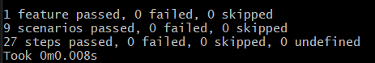

## 1. Nuevos escenarios en belly.feature  
Añadimos nuevos criterios de aceptación al belly feature:  
  
```gherkin  
    Escenario: Comer diferentes cantidades de pepinos en varios tiempos
        Dado que he comido 30 pepinos
        Cuando espero "una hora y treinta minutos"
        Entonces mi estómago debería gruñir

    Escenario: Comer pepinos sin especificar cantidad exacta
        Dado que he comido "un montón" de pepinos
        Cuando espero 3 horas
        Entonces mi estómago debería gruñir
  
    Escenario: Comer pepinos y esperar un tiempo exacto en minutos
        Dado que he comido 20 pepinos
        Cuando espero 120 minutos
        Entonces mi estómago debería gruñir
 
    Escenario: Comer pepinos en palabras y tiempo en minutos
        Dado que he comido "veinticinco pepinos"
        Cuando espero "noventa minutos"
        Entonces mi estómago debería gruñir
```  
  
Con esto nuevo implementado, habrán escenarios que fallen
  
  
## 2. Implementación de expresiones regulares para nuevos casos en belly_steps.py  
Añadimos `un montón` y `veinticinco`  

  
  
Además para que podamos capturar la cantidad de pepinos en `Dado que he comido "un montón" de pepinos` y en `Dado que he comido "veinticinco pepinos"` que son de los escenarios que han fallado, modificamos la función `step_given_eaten_cukes()` tal que así:

  
  
De esta forma todos los escenarios pasarán:  
  
  
  
## 3. Nuevos casos de prueba con excepciones  
  
Agregar casos para verificar errores o valores inesperados. Aquí verificamos que el sistema arroje un error cuando se ingresa una cantidad no válida de pepinos.  
  
```gherkin    
    Escenario: Comer una cantidad no válida de pepinos
        Dado que he comido "mil pepinos"
        Cuando espero 2 horas
        Entonces debería ocurrir un error de cantidad no válida
```   
  
En efecto nos lanza un error:  
  

  
Para solucionarlo añadimos: 
  

  
Entonces ese nuevo escenario debería no fallar:  
  

  
## 4. Validaciones extendidas y casos de límite en belly.py 
  
Agregar nuevas reglas de negocio y validaciones en la clase Belly para manejar más escenarios, como comer cantidades muy pequeñas de pepinos o tiempos de espera insuficientes.
  
  
  
## 5. Manejo de unidades de tiempo adicionales  
Hasta el momento el proyecto no reconoce tiempo esperado con segundos, es decir, este tipo de escenarios nos saldrá error: 
  
```gherkin    
    Escenario: Comer pepinos y esperar en segundos
        Dado que he comido 40 pepinos
        Cuando espero "3600 segundos"
        Entonces mi estómago no debería gruñir
```     
  
Para extenderlo hacemos unas modificaciónes en la función `step_when_wait_time_description()`  
  
  
  
Con dicho escenario debería correr satisfactoriamente 
 
  
  
## 6. Manejo de diferentes idiomas para la entrada  
  
Podemos ampliar el sistema para que acepte entradas en diferentes idiomas, por ejemplo, en inglés o español y pueda reconocer escenarios como este:  
  
```gherkin       
    Escenario: Comer pepinos y esperar en inglés
        Dado que he comido 15 pepinos
        Cuando espero "two hours and six minutes"
        Entonces mi estómago debería gruñir
```  
  
Para ello añadimos el siguientes objetos para dar soporte en inglés y español: 

  
  
Y modificamos la función `convertir_palabra_a_numero()` tal que asi:  
  
  
  
Además que de modificar la función `step_when_wait_time_description()` para que se pueda manejar la lógica con el tiempo en inglés:  

  
```python  

@when('espero {time_description}')
def step_when_wait_time_description(context, time_description):
    time_description = time_description.strip('"').lower()
    time_description = time_description.replace('y', ' ')
    time_description = time_description.replace('and', ' ')
    time_description = time_description.strip()

    if time_description == 'media hora':
        total_time_in_hours = 0.5
    else:
        pattern = re.compile(r'(?:(\w+)\s*horas?)?\s*(?:(\w+)\s*minutos?)?\s*(?:(\w+)\s*segundos?)?')  
          
        pattern_2 = re.compile(r'(?:(\w+)\s*hours?)?\s*(?:(\w+)\s*minutes?)?\s*(?:(\w+)\s*seconds?)?')  

        match = pattern.match(time_description)
        match_2 = pattern_2.match(time_description)
        
        if match.group(1) != None or match.group(2) != None or match.group(3) != None:
            hours_word = match.group(1) or "0"
            minutes_word = match.group(2) or "0"
            seconds_word = match.group(3) or "0"

            hours = convertir_palabra_a_numero(hours_word)
            minutes = convertir_palabra_a_numero(minutes_word)
            seconds = convertir_palabra_a_numero(seconds_word)

            total_time_in_hours = hours + (minutes / 60) + (seconds / 3600)  
        
        elif match_2.group(1) != None or match_2.group(2) != None or match_2.group(3) != None:  
            hours_word = match_2.group(1) or "0"
            minutes_word = match_2.group(2) or "0"
            seconds_word = match_2.group(3) or "0"

            hours = convertir_palabra_a_numero(hours_word)
            minutes = convertir_palabra_a_numero(minutes_word)
            seconds = convertir_palabra_a_numero(seconds_word)

            total_time_in_hours = hours + (minutes / 60) + (seconds / 3600) 
            
        else:
            raise ValueError(f"No se pudo interpretar la descripción del tiempo: {time_description}")

    context.belly.esperar(total_time_in_hours)  

``` 
  
Resultado: 


