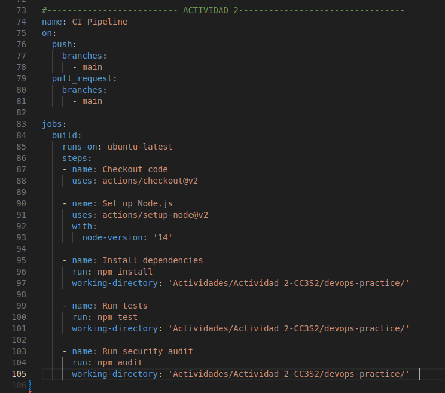

# 1. Preguntas de reflexión  
- **Pregunta 1: ¿Qué significa "desplazar a la izquierda" en el contexto de DevSecOPs y por qué es importante?**  
Teniendo en cuenta que la izquierda es el inicio y la derecha el final (como comunmente de grafican las líenas de tiempo) desplazar a la izquierda hace alusión a poner al inicio algo. En el contexto de DevSecOps se refiere a ver los temas se seguridad desde el principio y no al inicio como tradicionalmente se hacia antes, la importancia de esto es que puedes tomar medidas de seguridad desde que el software está siendo creado reduciendo así el costo si es que se hace al final con todo el software ya creado, peor aun con la gran variedad de tecnologías que hay, puede ser ineficiente, muy diferente a tomar los temas de seguridad desde el principio y durante el proceso de desarrollo (menos costo y mas seguro).  
  
- **Pregunta 2: Explica cómo laC mejora la consistencia y escalabilidad en la gestión de infraestructura**  
Cuando hablamos de infraestructura como CÓDIGO, hacemos referencia a automatizar el proceso de configuración de la infraestructura, es decir el código de la automatización cada vez que se ejecute siempre construirá y configurará todo por ti y siempre de la misma manera reduciendo los errores a comparacion de hacerlo manualmente esto favorece la consistencia, en cuanto a la escalabilidad, al ser todo automático agiliza dicho proceso, por ejemplo podremos crear varios servidores con sus respectivas configuraciones con un solo comando,además esto evita que gastemos tiempo haciendo tareas repetitivas.  
  
- **Pregunta 3: ¿Cuál es la diferencia entre monitoreo y observabilidad? ¿Por qué es crucial la observabilidad en sistemas complejos?**  
Monitoreo se refiere a vigilar problemas conocidos buscando garantizar que el software esté funcionando correctamente, no obstante tiene limitancias y es que podremos saber hay un problema pero no por qué, aspecto que si cubre la observabilidad, pues aquí puedes saber donde y por qué surgió algun error, esmas profundo en la vigilancia. Es crucial en sistemas complejos porque al ser complejo probablemente los problemas sean mas delicados de solucionar, mas aún el tratar de entender el por qué de ese problema, es ahi donde juega un papel crucial la observabilidad.  
  
- **Pregunta 4: ¿Cómo puede la experiencia del desarrollador impactar el éxito de DevOps en una organización?**  
La experiencia de desarrollador es básicamente crear un entorno donde los dev. puedar hacer su trabajo mejor, y si desarrollan bien, el producto es bueno, ya que lo se busca es que el equipo sea productivo y esten satisfecho con el trabajo, si el entorno es positivo entonces no hay silos dentro de la organización y el dialogo fluye garantizanco el éxtio del DevOps y de la organización.  
  
- **Pregunta 5: Describe cómo InnerSource puede ayudar a reducir silos dentro de una organización**  
Los silos son básicamente todas las barreras en el equipo, con InnerSource esto se rompe ya que permite la colaboración entre diferentes equipos, y no asilarse entre los miembros de uno solo equipo, y si se aplica bien con todos los pilares del InnerSource se garantiza una mejor experiencia del desarrollador, y como se respondió en la pregunta anterior esto favorece al producto final y a la organización.  
  
- **Pregunta 6: ¿Qué rol juega la ingeniería de plataformas en mejorar la eficiencia y la experiencia del desarrollador?**  
Al haber un equipo de plataformas, ellos preparán el entorno de trabajo con todas los servicios y herramientas necesarias, esto evita que el mismo desarrollador tenga que estar configurando dicho entorno manualmente, mejorando asi su comodidad de trabajo, es como si le dieras todos los materiales a un alabañil para trabajar evitando que este gaste tiempo en ir a comprarlar, si ya le das todo lo que necesita ahorrarás tiempo y esto juega a favor para la eficiencia.  
  
  
# 2. Poniendo en Práctica lo aprendido  
## 2.1 Configuración del entorno
### 1. Inicializa el proyecto de Node.js  
Creamos nuestro archivo de trabajo e inicializamos un proyecto node  

  
  
### 2. Intalar dependencias necesarias  
  
  
  
### 3. Crea la estructura del proyecto
Usanso los comandos de `mkdir src tests` y `touch src/app.js tests/app.test.js`, la estrcutura del proyecto debría ser tal que asi:  

  
  
### 4. Implementa la API REST en src/app.js  
Creamos una api donde al hacer una solicitud GET con un nombre como parametro, nos devolverá un texto saludando.

  
  
### 5 Escribe un test básico en test/app.test.js  
El test simula una solicitud para un name Silva, en teoría deberia mostrarme en panalla "Hello Silva" y este test es báscimanete para comprobar eso.  


  
### 6. Configura el  script de test en package.json  
Con esta configuración cada vez que pongamos `npm run dev` y `npm run test` se nos mostrará en el puerto asignado con su parámetro el saludo y correrá el test respectivamente

  
 
Si todo ha salido bien entonces al abrir el puerto desde nuestro navegador con algun parámetro por ejemplo `http://localhost:3000/Silva` debería salir algo como esto:
  
    
Y al ejecutar los test debería pasar satisfactoriamente:  

  
  
## 2.2 Implementación de DevSecOps  
  
### 1. Integración de Seguridad:  
Configura una herramienta de análisis de seguridad estática como npm audit para encontrar vulnerabilidades en las dependencias:  
Si sale como en la imágen de abajo significa que todas las dependencias están actualizadas o que no contienen problemas de seguridad que sean conocidos en la base de datos de vulnerabilidades de npm. :

  
  
### 2. Automatiza el análisis de seguridad en GitHub Actions  
Para ello se crea un archivo yml en nuestro workflow .github/workflows/ci.yml   
  
Lo que hace esto es definir unas acciones que se hará al momento de hacer push o pull request a la rama main, dichas acciones son configurar e instalar todas las dependencias necesarias para node, ejecutar los test y escanear las dependencias buscando si hay alguna vulnerabilidad, como vemos desde un inicio estamos viendo la seguridad, aspecto a tener en cuenta en DevSecOps pues hay un desplazamiento a la izquierda en la seguridad.   
  
Si todo a salido bien entonces en el GitHub Action:  
  
  
## 3. Implementación de Infraestructura como códifo (IaC)  
Usaremos docker para contenerizar la aplicación, para ello creamos un Dockerfile y ponemos las configuraciones que tendrá nuestro contenedor como la configuracion e instalacion de node.  
.  
  
Con el dockerfile creado ya podemos buildearlo y obtener nuestra imagen para después correrlo y crear nuestro contenedor  
Para construir la imágen usando el comando de la imágen:  

    
Luego corremos en contenedor la app:  
  
  
Y en teoría deberia aparecer en el puerto definido el saludo:  
  
  
### 3.1. Automatizar la gestión de contenedores usando Docker Compose  
Para ello nos ayudaremos con docker compose y codearemos el buildeo para que se haga de manera automática  
  
  
  
Corremos la aplicacion con docker compose usando el siguiente comando:  
```
    docker-compose up --build -d
```  
  
  
como se en la imágen de arriba se creo dicho contenedor de devops-practice y se está ejecutando en el puerto 3000, esto indica que el compose corrió bien  

## 4. Implementación de Observabilidad  
### 1. Creamos un archivo prometheus para configuralo
Con prometheus podremos monitorear nuestra app, para ello creamos un yml tal que asi: 
  
- `scrape_interval: 15s` inidica que cada 15seg prometheus recopilará las métricas.  
  
- `job_name: node-app` especifica el nombre para este trabajo de recolción.  
  
- `targets: [localhost:3000]` inidica la direccion y el puerto donde está nuestra aplicacion y por lo tanto a ella misma (la app) recoletar dichas métrica.
  
Nota: si no tienes instalado prometeus, debes instalarlo con el siguiente comando:  
```  
    sudo apt-get install prometheus
```  
  
Luego para ejecutar prometheus con el yaml creado ponemos en la terminalel siguiente comando:  
```
    sudo prometheus --config.file=prometheus.yml
```    
  

Si vemos detenidamente el mensaje en la terminal hay una linea que dice:  
`ts=2024-08-31T02:46:41.798Z caller=web.go:504 level=info component=web msg="Start listening for connections" address=0.0.0.0:9090`  
  
Esto significa que el servidor web de Prometheus está activo y puede ser accedido a través del navegador web en el puerto 9090.
  
Al acceder a ese puerto nos aparece en un input la opción de escoger una métrica y ver su gŕafica, en la imágen de abajo podemos ver la métrica `node_disk_read_bytes_total` que mide el número total de bytes leídos desde el disco del sistea desde quese inició el servidor  
  
  
### 2. Configurar Grafana utiilzando docker-compone  
  
  
Lo que hacemos es añadir dos servicios mas, una de ellas es prometheus usando la imágen oficial de esta herramienta que Docker tiene (líena 11) y luego añadimos al contenedor el archivo yml de nuestra maquina local y lo expondremos desde el puerto 9090.  
  
El segundo servicio es de grafana espuesta en el puerto 3001 utilizando también la imágen oficial de grafana de docker.  
  
Para ejecutar todos los sevicios definidos se usa el siguiente comando:  
```
    docker-compose up
```