# Actividad: Introducción a Git - conceptos básicos y operaciones esenciales  
  
## 1. git config: Preséntate a Git  
Para asignar el username y el correo asociando debemos usar los siguientes comandos:  
  
```
$ git config --global user.name "Juan Silva"
$ git config --global user.email "juan.silva.r@uni.pe"
```  
  
Para verificar que tu presentación se ha registrado, puedes comprobarlo con el comando `git config --list`  
  
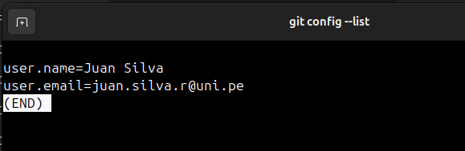  
  
## 2. git init: Donde comienza tu viaje a código
Creamos un directorio de trabajo, en nuestro caso lo llamamos  `Actividad 3-CC3S2` .Usando el comando `git init` inicializamos un nuevo repositorio de Git y comenzar a rastrear directorios existentes, además se crea un directorio .git que tiene todo lo necesario para el control de versiones
  
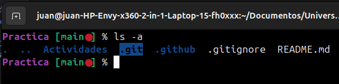  
  
## 3. git add: Prepara tu código
Con el comando `git add` podemos pasar los archivos a un estado de tracked (rastreado), primero debemos crear algun archvio dentro de nuestro directorio, en mi caso ya lo hice al momento de escribir y este readme, por lo tanto al poner git status para ver el estado del archivo:  
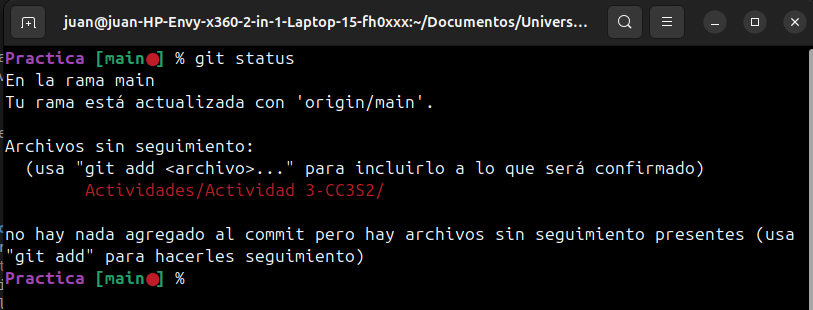  
Si queremos pasarlo a uns estado de rastreado podemos usar una opción de git add el cual es `git add .` esto rastrea todos los archivos:  
  
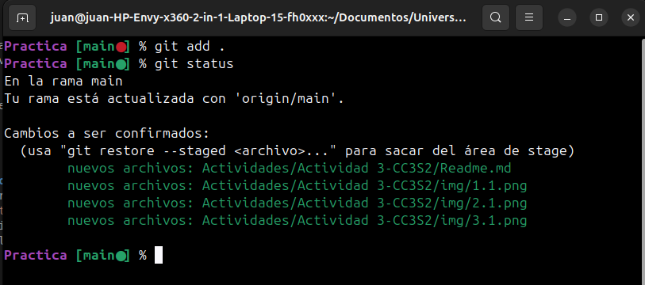  
  
## 4. git commit: Registra cambios  
Con el git commit registramos los cambios que previamente se preparamos con el git add, el commit viene con una bandera -m es para añadir un mensaje corto y descriptivo que especifique los cambios hechos:  
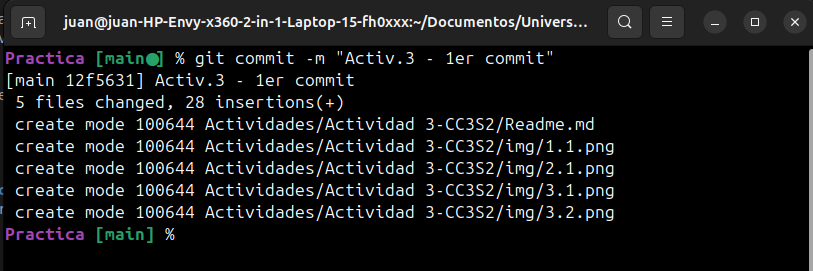.  
  
Veamos si en efecto los cambios han sido incorporados con el git status  
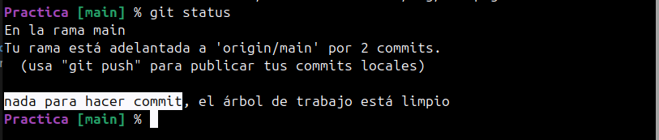  
  
## 5. git log: Recorrer el árbol de commits  
Este comando myestra una lista de commits realizados en orden cronólico inverso, es decir el commit más reciente se muestra primero  
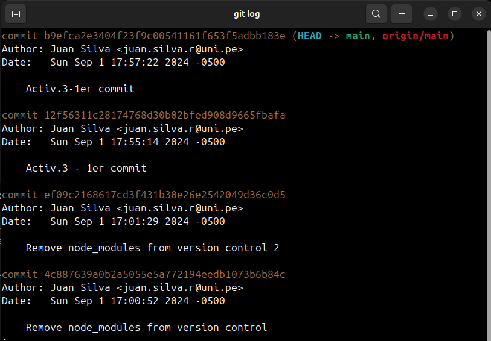  
  
Además del comando básico git log, hay numerosas opciones que te permiten adaptar la salida a tus necesidades:
- `git log -p`: Muestra la diferencia (es decir, el parche) introducida en cada commit.
- `git log --stat`: Proporciona algunas estadísticas abreviadas para cada commit.
- `git log --oneline`: Da una salida más compacta, mostrando cada commit como una sola línea.
- `git log --graph`: Visualiza la historia de branches y merges en un diseño de gráfico ASCII.
- `git log --author="Juan Silva`": Filtra los commits para mostrar solo los realizados por una persona
específica (en este caso, "Juan Silva").  
  
Probemos con el git log --graph: 
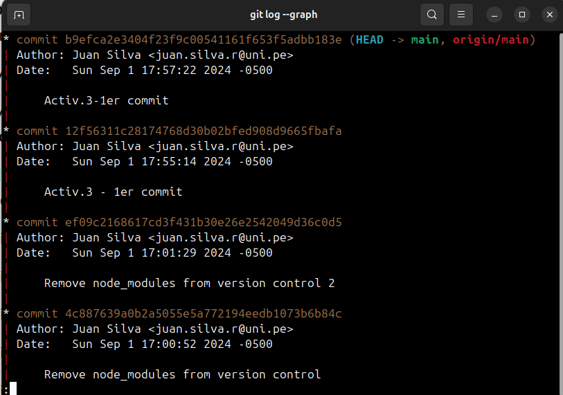  

En este caso nos sale una líena recta es porque al tener una sola rama main el historial de commit se ve linealmente, pero si hubieran mas de una rama, problablemente implicaría diferentes avances (en cada rama) y mergeos, y en ese caso se vería algo asi:  
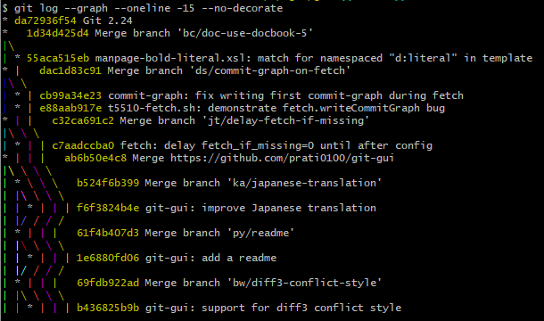  
  
También podemos mejorar la perpectiva de la siguiente manera:  
`$ git log --graph --pretty=format:'%x09 %h %ar ("%an") %s'`   
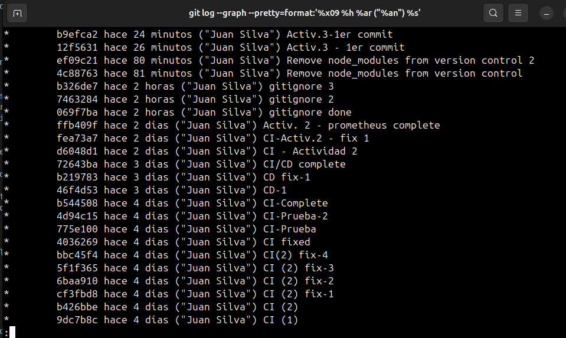  
  
Básicamente estamos añadiendo una personalizacion:  
- `%x09`: Representa una tabulación al princio.  

- `%h`: Muestra el hash abreviado del ID del commit.  

- `%ar`: Muestra el tiempo que ha pasado desde que se hizo el commit.  

- `("%an"):` Muestra el nombre del autor del commit entre comillas y entre paretesis.  

- `%s`: Muestra el mensaje del commit.  
  

### Intentemos el comando git log en el siguiente ejercicio:  
  
Creamos un archivo CONTRIBUTING.md y lo rastreamos y resgistramos en un commit:  
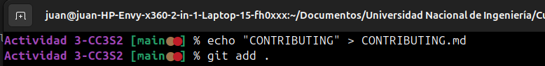  
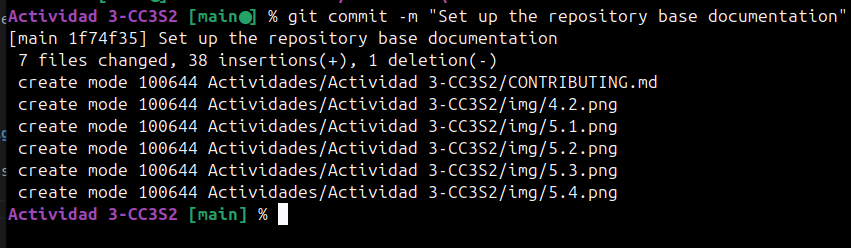 
  
Luego creamos un archivo `main.py` poniendo un simple hello world  
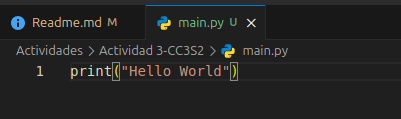