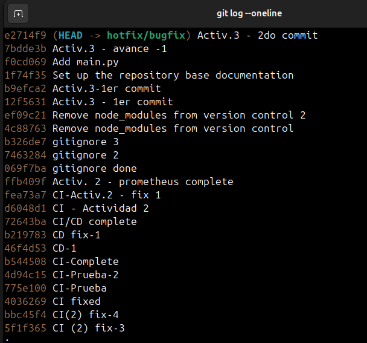

# Actividad: Introducción a Git - conceptos básicos y operaciones esenciales  
  
## 1. git config: Preséntate a Git  
Para asignar el username y el correo asociando debemos usar los siguientes comandos:  
  
```
$ git config --global user.name "Juan Silva"
$ git config --global user.email "juan.silva.r@uni.pe"
```  
  
Para verificar que tu presentación se ha registrado, puedes comprobarlo con el comando `git config --list`  
  
  
  
## 2. git init: Donde comienza tu viaje a código
Creamos un directorio de trabajo, en nuestro caso lo llamamos  `Actividad 3-CC3S2` .Usando el comando `git init` inicializamos un nuevo repositorio de Git y comenzar a rastrear directorios existentes, además se crea un directorio .git que tiene todo lo necesario para el control de versiones
  
  
  
## 3. git add: Prepara tu código
Con el comando `git add` podemos pasar los archivos a un estado de tracked (rastreado), primero debemos crear algun archvio dentro de nuestro directorio, en mi caso ya lo hice al momento de escribir y este readme, por lo tanto al poner git status para ver el estado del archivo:  
  
Si queremos pasarlo a uns estado de rastreado podemos usar una opción de git add el cual es `git add .` esto rastrea todos los archivos:  
  
  
  
## 4. git commit: Registra cambios  
Con el git commit registramos los cambios que previamente se preparamos con el git add, el commit viene con una bandera -m es para añadir un mensaje corto y descriptivo que especifique los cambios hechos:  
.  
  
Veamos si en efecto los cambios han sido incorporados con el git status  
  
  
## 5. git log: Recorrer el árbol de commits  
Este comando muestra una lista de commits realizados en orden cronólico inverso, es decir el commit más reciente se muestra primero  
  
  
Además del comando básico git log, hay numerosas opciones que te permiten adaptar la salida a tus necesidades:
- `git log -p`: Muestra la diferencia (es decir, el parche) introducida en cada commit.
- `git log --stat`: Proporciona algunas estadísticas abreviadas para cada commit.
- `git log --oneline`: Da una salida más compacta, mostrando cada commit como una sola línea.
- `git log --graph`: Visualiza la historia de branches y merges en un diseño de gráfico ASCII.
- `git log --author="Juan Silva`": Filtra los commits para mostrar solo los realizados por una persona
específica (en este caso, "Juan Silva").  
  
Probemos con el git log --graph: 
  

En este caso nos sale una líena recta es porque al tener una sola rama main el historial de commit se ve linealmente, pero si hubieran mas de una rama, problablemente implicaría diferentes avances (en cada rama) y mergeos, y en ese caso se vería algo asi:  
  
  
También podemos mejorar la perpectiva de la siguiente manera:  
`$ git log --graph --pretty=format:'%x09 %h %ar ("%an") %s'`   
  
  
Básicamente estamos añadiendo una personalizacion:  
- `%x09`: Representa una tabulación al princio.  

- `%h`: Muestra el hash abreviado del ID del commit.  

- `%ar`: Muestra el tiempo que ha pasado desde que se hizo el commit.  

- `("%an"):` Muestra el nombre del autor del commit entre comillas y entre paretesis.  

- `%s`: Muestra el mensaje del commit.  
  

### Intentemos el comando git log en el siguiente ejercicio:  
  
Creamos un archivo CONTRIBUTING.md y lo rastreamos y resgistramos en un commit:  
  
 
  
Luego creamos un archivo `main.py` poniendo un simple hello world  
  
  
Y lo rastreamos y comiteamos:  
  
  
Y luego confirmemos en el log que está correctamente registrado:  
  `g$ git log --oneline`

  
  
## 6. git branch: Entendiendo los conceptos básicos de Git branch  
  
Con el el comando `git branch` podremos listar todas las ramas de nuestro repositorio.  
En nuestro caso solo hay una rama (la main)  
  
  
  
Creamos una nueva rama con:  
```
$ git branch feature/new-feature
``` 

  
  
  
  
## 7. git checkout/git switch: Cambiar entre branches
Con el siguiente comando podremos cambiar de rama:  
```
  $ git checkout feature/new-feature
```  
  
  
### Ejemplos adicionales:  
### Crea una branch desde una branch específica:  

- Creamos una rama develop   

 
  
- Cambia a la rama develop si no estás en ella:  

  
- Crea una nueva rama 'feature/login' desde 'develop':  
   
Verificamos con un git branch  


  
- Cambia a la nueva rama 'feature/login':  

  
### Crear una branch desde un commit específico:  

- Verifica el historial de commits para identificar el commit específico  


- Crear una nueva rama 'hotfix/bugfix' basada en el commit 'e2714f9'  

  

- Cambia a la nueva rama 'hotfix/bugfix  

  


Las versiones recientes de Git también ofrecen el comando git switch, que proporciona una forma más intuitiva de cambiar branches:  

- Cambiar a la branch 'feature/login':  

  
A veces, puede resultar eficiente crear una nueva branch y cambiar a ella inmediatamente. Git proporciona un comando abreviado para esto, que combina la funcionalidad de `git branch` y `git checkout` o `git switch`. Para crear una nueva branch y cambiar a ella en un solo paso, puedes usar el comando `git checkout -b`:  
  
- Crear y cambiar a una nueva branch  
  
  

Eso es equivalente a ejecutar los siguientes comandos de manera seguida:  
```  
  $ git branch feature/another-new-feature
  $ git checkout feature/another-new-feature
```  
  
En las versiones recientes de Git, puedes lograr lo mismo con git switch usando la opción -c:  

- Crear y cambiar a una nueva branch:   

  
## 8. git merge [Branch Name] : Fusionando branches  
Para efectuar un merge primero nos situamos en una rama diferente a la del main y hacemos algún cambio, en nuestro caso hacemos el cambio en el archivo main.py:  
  
Vemos que en efecto el estado del archivo cambió a modificado  

     

Entonces procedemos a rastrear dicho cambio y commitearlo:  

   
  
Regresamos a la rama main que es la rama que recibirá los cambios y procedemos a realizar un merge con la ramma que queremos fusionar, esto lo logramos haciendo un `git merge feature/another-new-feature-2` y como vemos en el mensaje de la imágen de abajo, el mergeo se realiza:  

  
  
Cuando realizamos el merge nos pedirá que escribamos un mensaje que explique la necesidad de hacer dicha fusion
  

## 9. git branch -d : Eliminando una Branch  
El comando `git branch -d [branch name]` sirve par  eliminar una rama, el flag -d indica delete y elimina alguna rama si esta ya ha sido fusionada, en cambio si ponermos `git branch -D [branch name]` la eliminará sin importar que no haya sido fucionada  
  
