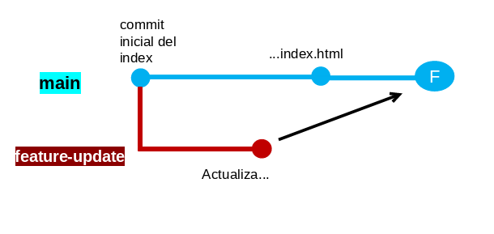
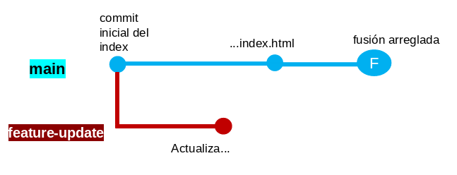
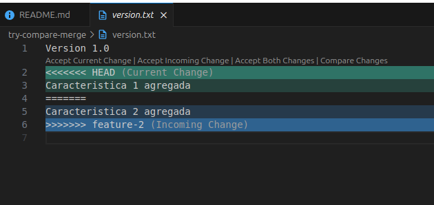
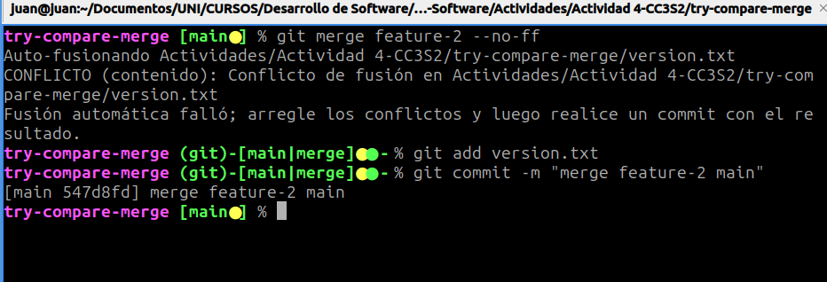

# Actividad: Explorando diferentes formas de fusionar en Git

## 1. Fusión Fast-forward (git merge --ff)  
La fusión fast-forward es la forma más simple de combinar ramas en Git. Solo es posible cuando la rama base no ha recibido nuevos commits desde que se creó la rama feature. 
### 1.1 Creamos un nuevo repositorio  
  
  
### 1.2 Agregar un archivo inicial en la rama principal (main) 
  
  
### 1.3  Crear y cambiar a una nueva rama 'add-description'  
  
  
### 1.4 Hacer cambios en la nueva rama y comitearlos  
  
  
### 1.5 Cambiar de vuelta a la rama 'main' y realizar la fusión fast-forward  
Para hacer dicha fusión se logra con un simple `git merge add-description`
  
  
Resultado en un git log seria tal que asi:  
  
Vemos que se mueve el puntero HEAD de la rama main al último commit de la rama de add-description. Como resultado, el historial de commits permanece lineal y
sin interrupciones.
  
## 2.  Fusión No-fast-forward (git merge --no-ff)  
La fusión no-fast-forward crea un nuevo commit de fusión. Es útil para preservar el contexto de la fusión, especialmente en equipos donde se requiere más claridad en el historial de cambios.  
  
### 2.1 Crear un nuevo repositorio  
  
  
### 2.2 Agregar un archivo inicial en la rama principal (main)  
  
  
### 2.3 Crear y cambiar a una nueva rama 'add-feature'  
  
  
### 2.4 Hacer cambios en la nueva rama y comitearlos  
  
  
### 2.5 Cambiar de vuelta a la rama 'main' y realizar una fusión no-fast-forward   
Esto se logra con el comando `git merge --no-ff add-feature` 
  
  
Tener en cuenta que al momento de hacer el merge nos aparecará la opción de escribir el motivo de por qué la fusión, esto es el mensaje descriptivo del commit de fusión que se crea al hacer este tipo de merge, en este caso pusimos `Practicando git merge no-fast-forward`
 
  
Como resultado al mostrar los log en un gráfico, vemos que se creo un nuevo commit de fuscion (Merge branch) con el mensaje que pusimos
  
  
## 3. Fusión squash (git merge --squash)  
La fusión squash combina todos los cambios de una rama en un solo commit en la rama principal. Este método es útil cuando se quiere mantener un historial de commits limpio.
  
### 3.1 Crear un nuevo repositorio  
  
  
### 3.2 Agregar un archivo inicial en la rama principal (main)  
  
  
### 3.3 Crear y cambiar a una nueva rama 'add-basic-files'  
  
  
### 3.4 Hacer algunos cambios y comitearlos  
Primero añadimos un CONTRIBUTING.md y lo comiteamos
  
  
Luego añadimos otro archivo LICENSE.txty lo comiteamos, entonces en total tendriamos 2 commit hechos en la ramma add-basic-file   

  
### 3.5 Cambiar de vuelta a la rama 'main' y realizar la fusión squash  
  
    
Los dos commit hechos en la rama add-basic-file se han aplasado en un solo commit y esta puesto en un la rama main, Git no crea automáticamente un commit en la rama main,  porque te permite modificar el mensaje del commit o ajustar el contenido antes de guardarlo.  
Recuerda: un merge squash sólo prepara los cambios pero no los guarda de forma permanente hasta que hagas un commit explícito en la rama objetivo.   
  

### 3.6 Para completar la fusión squash, realiza un commit:  
  
  
El resultado:  
  
   
# Resolver conflictos en una fusión non-fast-forward  
### 1. Inicializamos nuestro repositorio
  
  
### 2. Crea un archivo index.html y realizamos un commit en main  
En este caso el commit se llama "commit inicial del index en main"
  
  
### 3. Creamos una rama feature-update
  
  
### 4. Editamos el index y realizamos un commit  
El commit en esta rama se llamará "Actualiza ..."  
  
  
### 5. Volvemos a la rama main y realizamos otro commit  
Para ello editaremos una vez mas el archivo index y añadieremos un foorter y lo comitearemos con el mensaje "...index.html"
  
  
Entonces lo que de momento tenemos es como se muestra en la gráfica y se busca hacer una fusion no-fast-forward como indica la flecha creando asi el commit de fusion (circulo de F)  

    

  
### 6. Fusiona la rama feature-update con --no-ff  
Notamos que hay un conflicto en la fusion, especificamente en el archivo index.html
   
Al abrir nuestro editor de código, notaremos donde específicamente está el conflicto, resulta que en la rama main, la etiqueda footer está en la linea 2, pero en la rama feature-update, en la linea 2 no existe dicho footer, si no la etiqueda \
 y git no sabe cómo ordenar eso al momento de fusionar, entonces una opción para solucionar ese conflicto es arreglandolo manualmente

Luego de arreglarlo editandolo manualmente, debería quedar algo asi:
  
  
### 7. Agregar el archivo corregido y completa la fusión  
Como ya tenemos una versión definida de nuestro index-html, entonces procedemos a agregarlo al staging y comitearlo
  

Gaficamente se veria tal que asi

 
O asi:  

  
  
### Preguntas:  
### 1) ¿Qué pasos adicionales tuviste que tomar para resolver el conflicto?  
Tuve que editar manualmente el archivo donde existia el conflicto, para ello abrimos nuestro editor de código, visual studio code, y ordenamos todo el index.html

### 2) ¿Qué estrategias podrías emplear para evistar conflictos en futuros desarrollos colaborativos?  
Debéria haber una mejor repartición de responsabilidades entre los desarrolladores, de tal forma que dos desarrolladores no estén editando el mismo archivo cada uno desde dos ramas distintas como sucedió en esta activida donde el archivo index.html se editó desde dos ramas, main y feature-update, y si por algún X motivo se ven obligados a hacerlo, entonces sería bueno una constante comunicación para tener todo milimétricamente calculado y se evite conflicto al momento de fusionar
  
## COMPARAR LOS HISTORIALES CON GIT LOG DESPUÉS DE DIFERENTES FUSIONES  
### 1. Creamos nuestro directorio de trabajo
  
  
### 2. Realizamos el primer commir en la rama main  

  
  
### 3. Creamos una rama feature-1 y añadimos un commit en esta rama

  
  
### 4. Creamos otra rama feature-2 y añadimos un commit en esta rama

  
  
### 5. Merge ff entre feature-1 y main
    

 Vemos que el commit de feature-1 se mueve a la rama main y se mantiene la linealidad   
   

### 6. Merge no-ff entre feature-2 y main
  
Notamos que hay un conflicto y es porque en una misma linea en diferentes ramas hay diferente contenido (Caracteristica 1 agregada y Caracteristica 2 agregada)  

  
  
Lo resolvemos manualmente en el editor de código  

  
  
Luego lo añadimos al staging y comiteamos dicha fusion
  
    
Notamos que se creo un nuevo commit de fusion (merge feature-2 main), es decir hay una bifurcación como se muestra en el gráfico

  
  
### 7.Creamos una tercera rama feature-3 y añadimos 2 commits

  
  
### 8. Merge squash entre main y feature-3  
Hacemos un mergeo de tipo squash con
  
    
Notamos que todos los commits de la rama feature-3 se juntan en un solo commit (Agregarcaracteristica 3 en un commit) en el main, manteniendo un historial limipio como se muestra en la imágen

  
  
## Prregunta  
### 1. ¿Qué métodos prefieres en diferentes escenarios y por qué?  
*Fast-Forward*: Yo lo usaria cuando las correciones a integrar son pequeñas porque con el ff se mantiene la simplicidad y/o linealidad por lo tanto el historial se mantiene lineal sin bifurcaciones.  
  
*No-Fast-Forward*: Este tipo de merge lo usaria cuando hay un equipo con varios contribuyentes, y los aportes que estos hagan fusiones de características grandes, asi se podrá saber en qué momento se intergró una nueva caracteristica con el git de fusion, facilitando la claridad..
  
*Squash*: Este merge lo usaría cuando en una rama los commits son pequeños y no hay tanta preocupación de mantener los commits individuales, entonces todos esos pequeños commits los aplastamos en uno para el mergeo.
