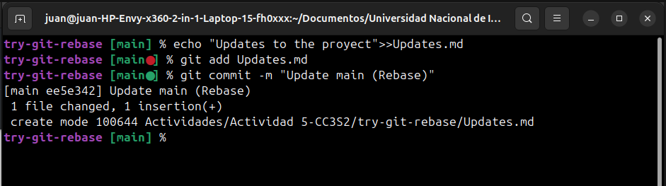

# Actividad: Entendiendo git rebase y git cherry-pick
## 1. Parte 1: git rebase para mantener un historial lineal  
  
### 1.1. Crea un nuevo repositorio Git y dos ramas, main y new-feature:  
  
  
### 1.2. Realizamos un Commit en la rama main  
Para ello añadimos un archivo Texto.md y lo commiteamos:  
  
  
### 1.3 Realizamos un commit en otra rama "new-feature"
  

### 1.4 Nos trasladamos a la rama main para hacer otro commit
  

En este caso el commit es para registrar un nuevo archivo Update.md
  
  
### 1.5 Realizamos el rebase de new-feature sobre main con los siguientes comandos:
  
  
### 1.6 Visualizamos el historial de commits
  
  
### 1.7 Momento de fusionar y completar el proceso de git rebase
  
  
  
  
## Parte 2: git cherry-pick para la integración selectiva de commit  
### 2.1 Inicializar un nuevo repositorio
   
  
### 2.2 Agregar y commitear Texto.md inicial a main  
Entonces en la rama main solo habria un commit llamado "Inicial commit main (chery-pick)", luego crearemos otra rama con un par de commits y escoger una para integrarlo en esta rama main
    
  
### 2.3 Crear y cambiar a una nueva rama 'add-base-documents' y hacemos un commit (CONTRIBUTING.md)
    
  
### 2.4 Luego hacemos otro commit (LICENSE.txt)
    
  
### 2.5 Echamos un vistazo al log de la rama 'add-base-documents'  
Notamos que en esta rama hay dos commits, una del CONTRIBUTING y otro el de LICENSE
   
  
### 2.6 Hacemos cherry-pick de un commit de add-base-documents a main:  
En este caso selecionamos el primero commit hecho de la ramma add-base-documents, (Add-CONTRIBUTING) para hacerlo un cherry pick a la rama main 
  
