# Actividad: Navegando conflictos y versionado en un entorno DevOp  
  
### 1. Inicialización del proyecto y creación de ramas 

Creamos nuestro directorio de trabajo: 
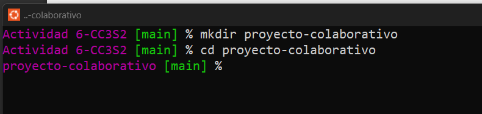  
  
En la rama main creamos un txt y realizamos nuestro primer commit en ella:  
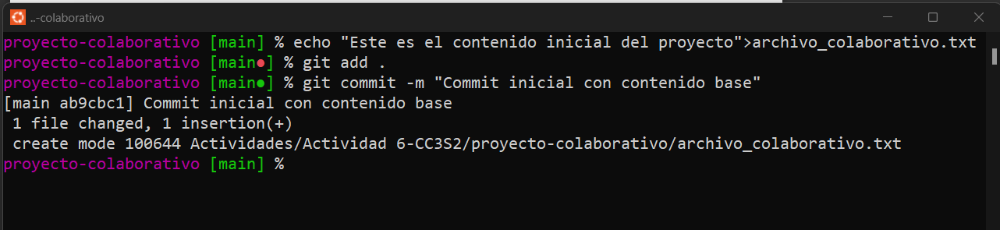  
  
Luego creamos una segunda rama llamada feature-branch y en ella realizamos un commit en ella, como se muestra en la imágen
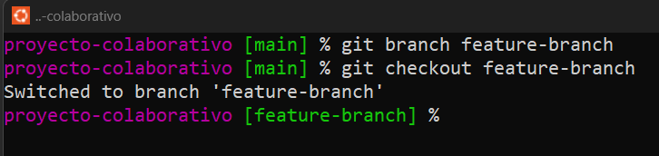  
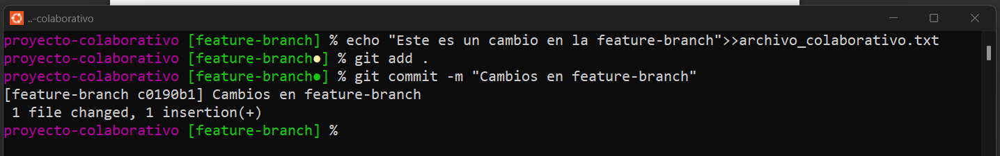  
  
Luego en la rama main realizamos otra modificacion y otro commit 
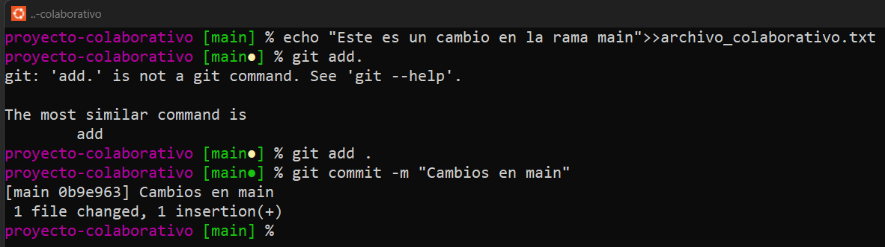  
  
Por lo tanto el archivo se vería tal que asi:  
En la rama main tenemos:  
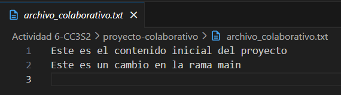  

Y en la rama feature-branch se veria tal que asi
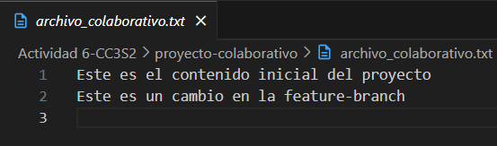  
  
Notamos que en ambos ficheros la linea 2 está la diferencia por lo tanto si quisieramos fusionarlo git no sabría que version tomar en la línea 2.  
  

### 2. Fusión y resolución de conflictos  
Como lo previsto al querer hacer un merge entonces sucederá un conflicto
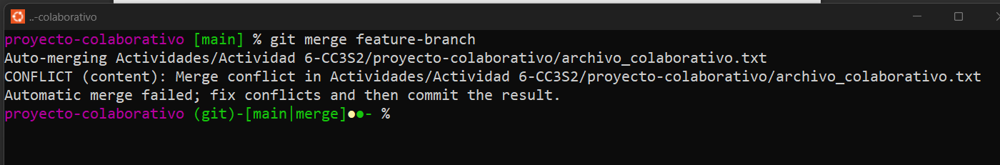  
  
Al ver el estado vemos que hay un archivo que ha sido modificado en ambas ramas (letras) rojas, inclusive en la imágen anterior nos específica donde está el conflicto
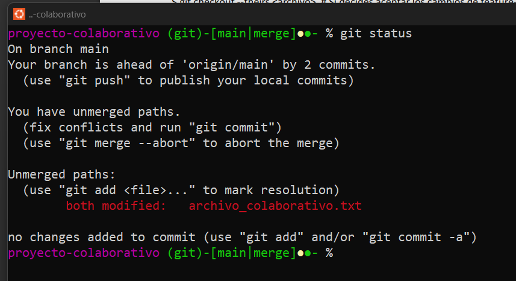  
  
En este caso para resolver el conflicto usamos `checkout --theirs` el cual hace que mantengamos la versión de la otra rama, es decir en la segunda línea estará `Este es un cambio en la feature-branch` 
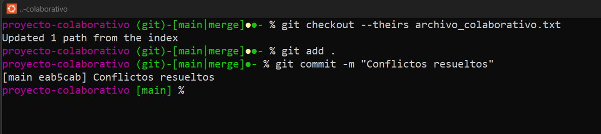  
  
### 3. Simulación de fusiones y uso de git diff  
Intentamos hacer un merge sin comitear nada, pero, debido al mergeo anterior, no hay ningun cambio que integrar en la rama main
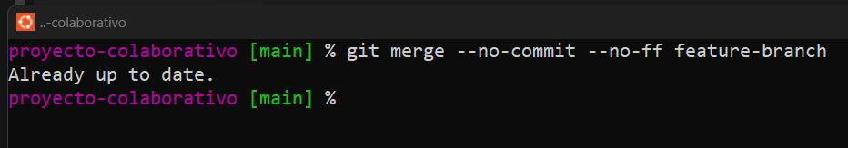  
  
Entonces procedemos a hacer un cambio en el archivo añadiendo una nueva línea en la rama feature-branch y procedemos a comitearlo
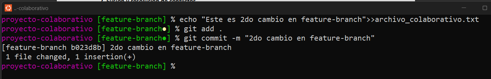  
  
Entonces al hacer el mergeo pero sin comitearlo
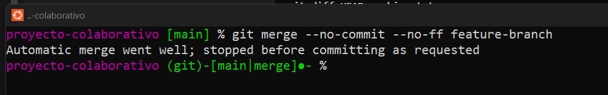  
  
Utilizamos el comando `git diff --cached`  que compara los cambios entre versiones de un archivo. En este caso las líneas sin prefijo (como "Este es el contenido inicial del proyecto") indican que son iguales en ambas versiones, pero las líneas de color verde indican contenido nuevo o cambiado. En este caso, se añade la línea: "Este es un segundo cambio en feature-branch".
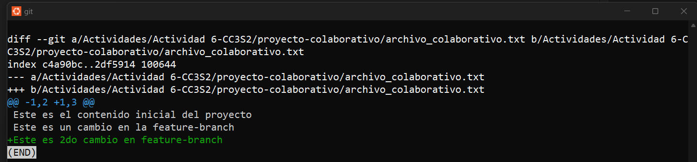  
  
Luego procedemos a abortar la fusión con un `git merge --abort`
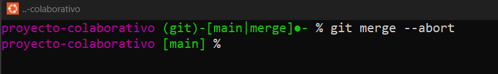  
  
### 4. Uso de git mergetool  
Configuramos git mergetool con una herramienta de fusión visual, en este caso usamos vimdiff
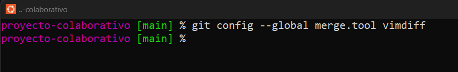  
  
Luego intentamos forzar un conflicto, para ello añadimos una nueva linea, es decir una una actualizamos en el archivo txt y lo comiteamos
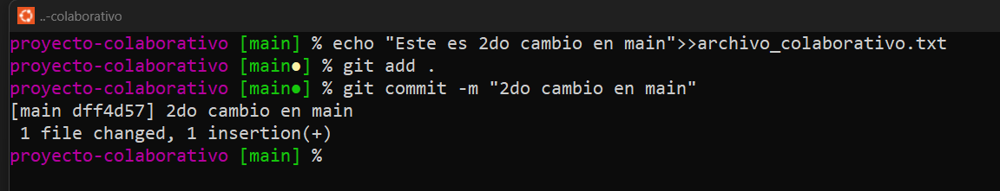  
  
Por lo tanto el en la línea 4 se vería reflejado dicho cambio  
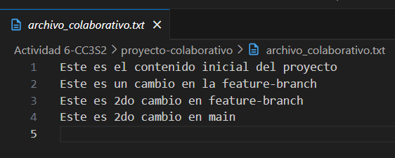  
  
Procedemos a hacer el mismo proceso pero en la rama feature-branch
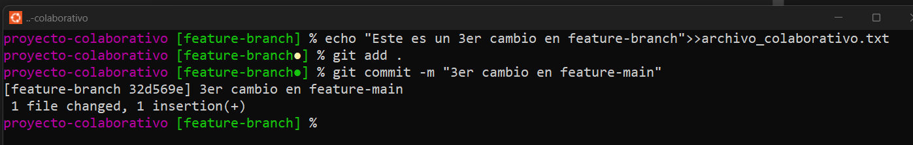  
  
Por lo tanto en la línea 4 estaría reflejado ese cambio, el cuál al querer fusionarlo implicaría un conflicto  
  
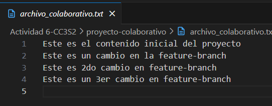  
Intentamos hacer una fusión y eso evidentemente nos dará un conflicto como lo esperabamos, 
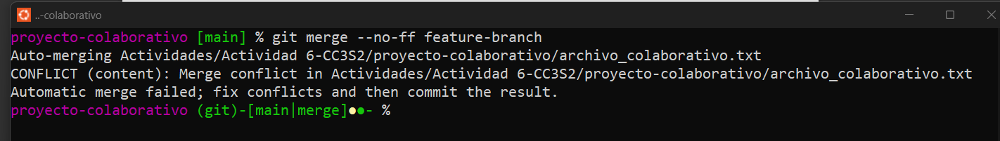  
  
Entonces utilizamos la herramienta `git mergetool` y eso nos mostrará lo que muestra en la imágen:
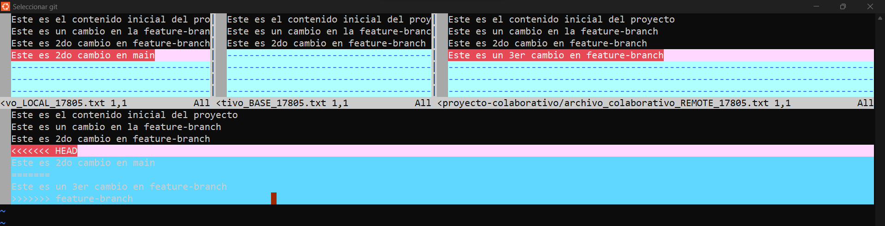  
  
Lo que aparece en la parte izquierda son los cambios desde la rama main que se quiere integrar (marcado de rojo), al lado derecho están los cambios que se quiere integrar de la rama feature-branch y en el centro nos sale una version sin la integración de ambas ramas  
  
Por lo tanto podemos corregirlo editandolo y a final quedarnos con una versión final, en nuestro caso luce tal que asi:  
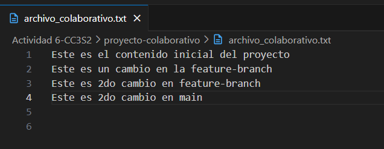  
  
