# Actividad 7  
**Actividad:** Gestión ágil de proyectos con GitHub Projects: Configuración de Kanban Board y Creación de Historias de Usuario.  
  
## Parte 1  
1. Navega al repositorio del curso donde has estado trabajando en GitHub.  

2. Una vez que estés en la página del repositorio, haz clic en la pestaña Projects, como se  muestra en la captura de pantalla a continuación.  
  
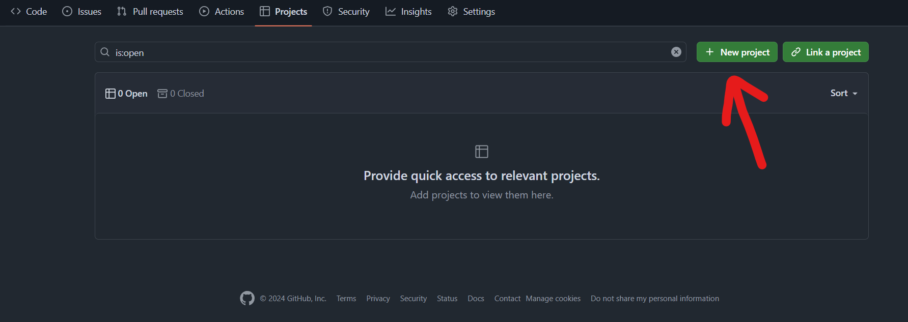  
  
3. Al lado del botón Link project, haz clic en el menú desplegable y selecciona New Project.  

4. Después de hacer clic en el botón New Project, aparecerá una ventana emergente para crear un proyecto. Selecciona Kanban, como se muestra en la captura de pantalla.  
  
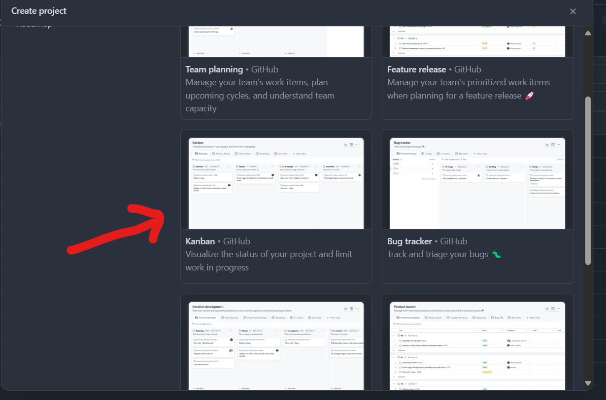  
  
5. Nombra tu proyecto como Lab Agile Planning y procede haciendo clic en el botón Create  project.  
  
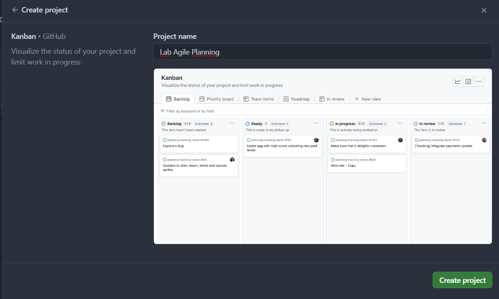

6. En el Kanban board del proyecto, tendrás columnas para representar diferentes etapas de tu flujo de trabajo, como Backlog, Ready, In Progress, In review, y Done. Puedes agregar columnas personalizadas según los requisitos de tu flujo de trabajo.  
  
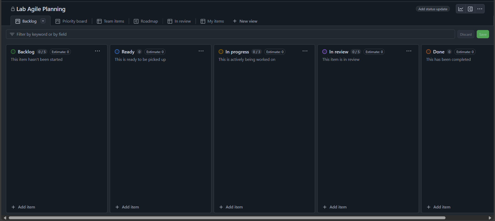 
  
7. Para personalizar o modificar el nombre de una columna, haz clic en los tres puntos y luego selecciona Edit details   
  
8. Cuando hagas clic en Edit details, aparecerá una ventana emergente, como se muestra en la captura de pantalla a continuación. Introduce el nombre de la columna requerido en el cuadro de texto resaltado. Puedes agregar una descripción apropiada o elegir eliminarla, luego haz clic en Save para confirmar los cambios.  
De manera similar, renombra las columnas restantes de la siguiente manera:  

    ▪ Renombra la columna Ready a Icebox.  

    ▪ Deja la columna In Progress tal como está.  

    ▪ Renombra la columna In review a Review/QA.  

    ▪ Deja la columna Done tal como está.  
  

9.  Después de realizar los cambios mencionados, tu Kanban board debería verse así:  

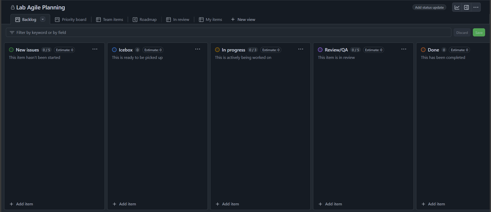  
  
10. Para agregar una nueva columna, navega al final de las columnas existentes y haz clic en el botón +. Luego, selecciona New column de las opciones. Introduce el nombre de la columna como Product Backlog en el campo de texto Label, y finalmente, haz clic en Save para aplicar los cambios.  
  
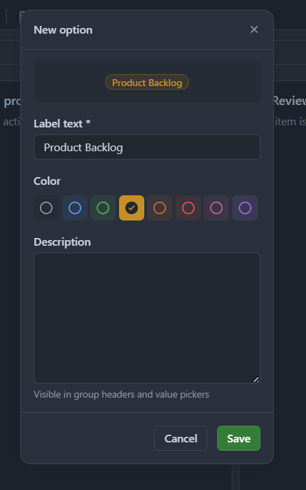  
  
11. Para establecer la secuencia correcta en el Kanban board, arrastra la columna Product Backlog y colócala antes de la columna In Progress. La flecha en la captura de pantalla a continuación indica desde dónde necesitas arrastrar y soltar la columna.  
  
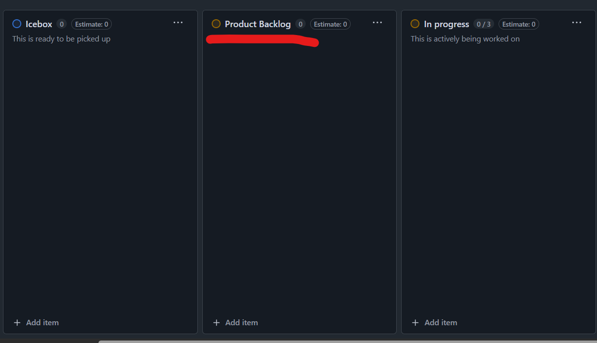  
  
12. De manera similar, crea la columna Sprint Backlogs, y luego reorganízala para que se asemeje al Kanban board mostrado a continuación.  
  
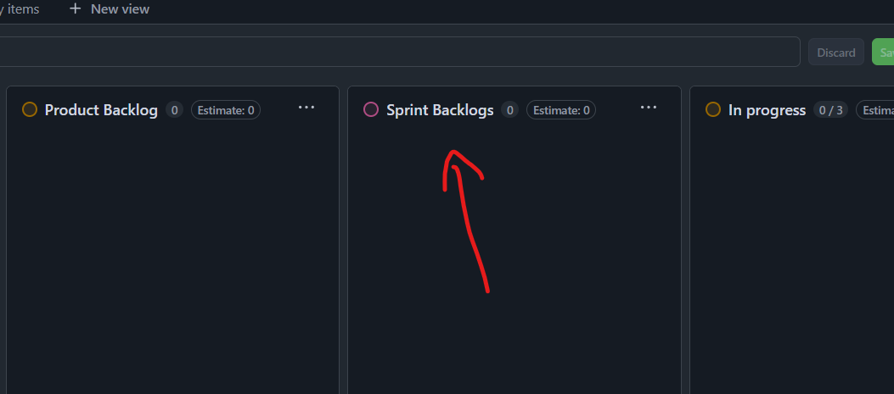  
  
## Parte 2  
En este ejercicio, crearás una issue template en GitHub que te ayudará a escribir historias de usuario bien formateadas en el Kanban board.
  
### Crear una issue template en GitHub  

En este ejercicio, crearás una issue template en GitHub. Esto solo necesita hacerse una vez para cada nuevo repositorio que crees.  

1. En la página del repositorio que usaste en el ejercicio anterior, selecciona Settings.  

2. Desplázate hacia abajo hasta la sección Features y selecciona Set up templates.  
  
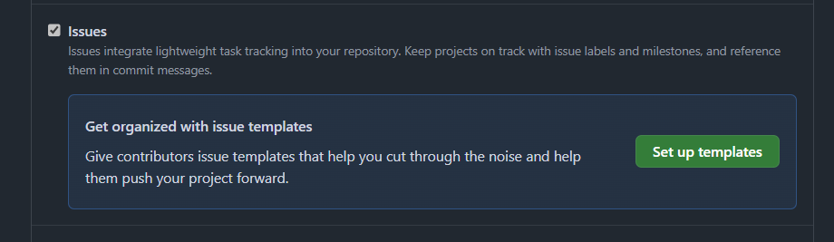  
  
3. En la lista desplegable etiquetada Add template, selecciona Custom template  
  
4. Al lado de la entrada Custom issue template, presiona el botón Preview and edit.
  
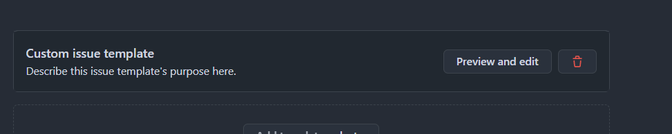  
  
5. Selecciona el icono del lápiz para editar la template.  
  
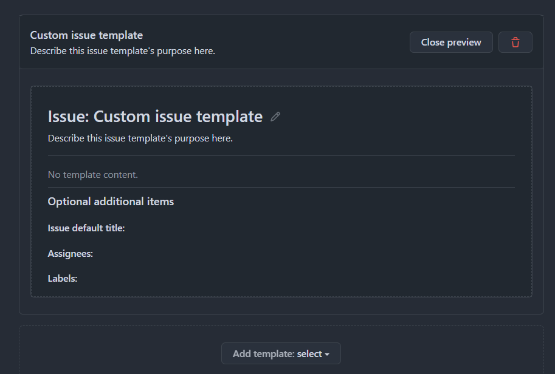  
  
6. Copia el siguiente markdown para el contenido de la pantalla de historia:  
```  
    **As a** [role]  
    **I need** [function]  
    **So that** [benefit]  
    
    ### Details and Assumptions  
    * [document what you know]  
    
    ### Acceptance Criteria  
    
    ```gherkin  
    Given [some context]  
    When [certain action is taken]  
    Then [the outcome of action is observed]  
    ```  
``` 
  
7. Cambia el Template name a User Story, dale una descripción apropiada, y pega el contenido del markdown anterior en el Template content.  
  
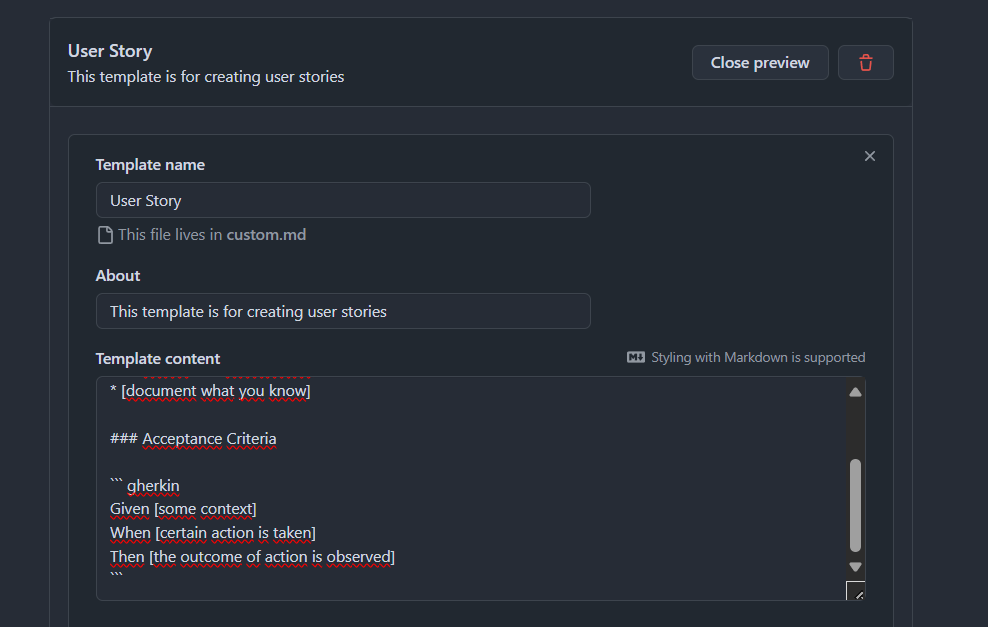  
  
8. Desplázate hacia la parte superior de la página y presiona el botón Propose changes.  

9. Presiona el botón Commit changes para confirmar el cambio en tu repositorio.  
  
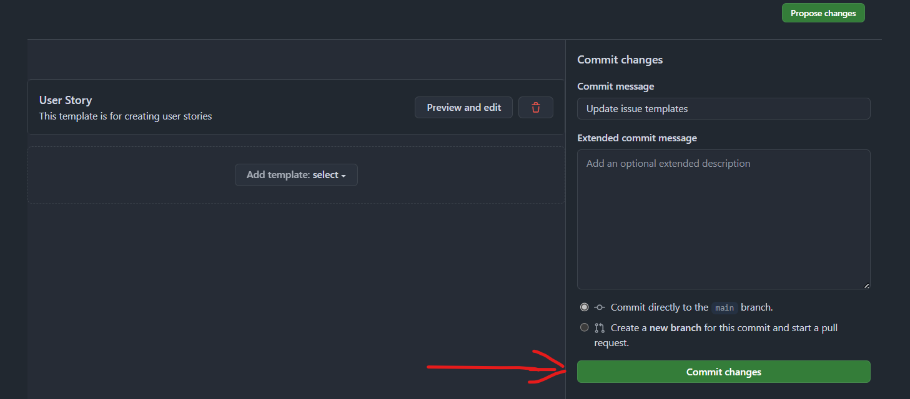  
  
10. Ahora deberías tener una nueva carpeta en tu repositorio llamada 
`.github/ISSUE_TEMPLATES`, que contendrá tu nueva issue template de historia de usuario.  
  
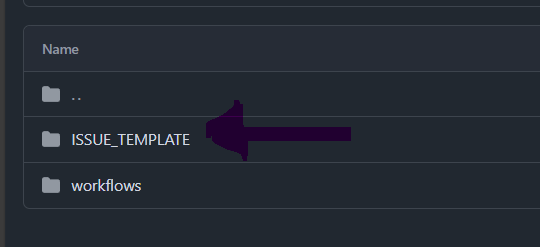  
  
Contenido del archivo `user-story.md`  
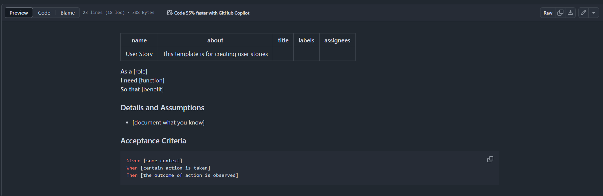  
  
## Parte 3  
En este ejercicio crearás siete historias de usuario basadas en los requisitos dados. Las primeras cuatro se te proporcionarán. Solo tendrás que copiarlas y pegarlas para familiarizarte con la creación  de historias de usuario en GitHub. Deberás crear las últimas tres historias de usuario por ti mismo. Luego priorizarás estas historias y las moverás a las columnas apropiadas en tu Kanban board.

### Requisito previo:  
1. Ve a la pestaña Issues del repositorio del curso o donde estés trabajando la actividad.  

2. Haz clic en el botón New issue  
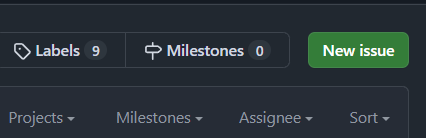  
  
3. Verás tu template listada aquí. Haz clic en el botón Get Started.  
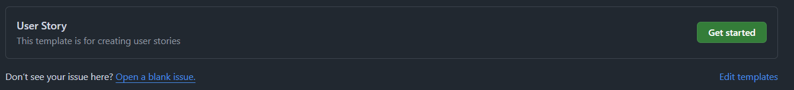  
  
4. Introduce el título para la primera historia como **Need a service that has a counter** y actualiza la sección de historia de usuario (es decir, **As a, I need, So that**) por ahora. Una vez hecho, haz clic en el botón **Submit new issue**.  
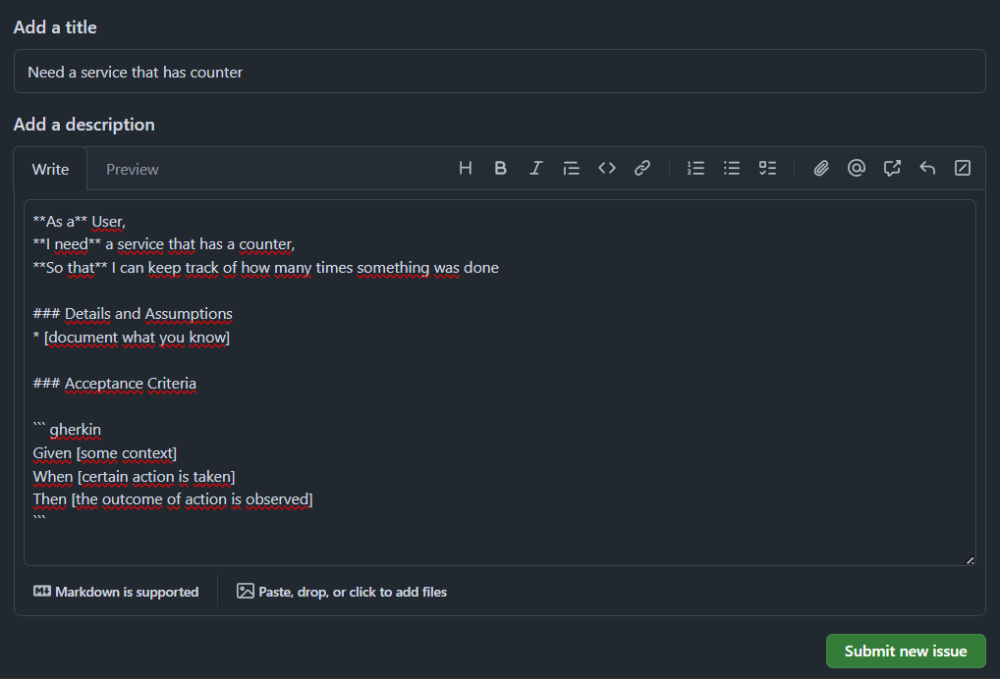  
  
5. Tu primera historia de usuario ahora está creada y debería parecerse a la captura de pantalla mostrada a continuación.

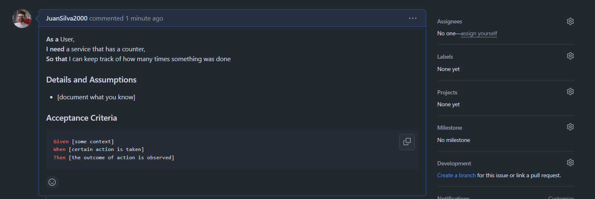  
  
6.  Agregar la historia de usuario creada al Kanban board, haz clic en el botón de configuración al lado de la opción Projects, y luego elige el proyecto Lab Agile Planning del menú desplegable que creaste en el ejercicio anterior.  
  
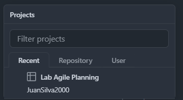  
  
7. A continuación, selecciona el menú desplegable Status y elige New Issues. Esta acción moverá la historia de usuario creada a la columna 'New Issues' en el Kanban board.  
 
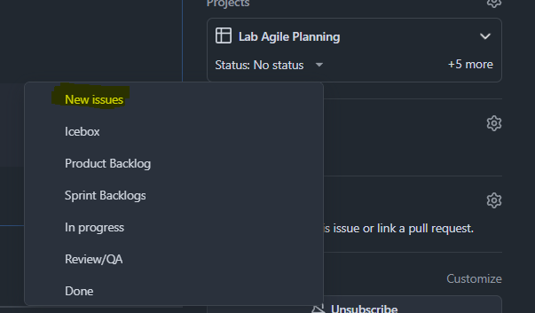   
  
8. Para ver la historia de usuario recién creada en el Kanban board, navega a la pestaña Projects y selecciona el proyecto titulado Lab Agile Planning.  
  
9.  Notarás que la historia de usuario recién creada ahora está listada bajo la columna New Issues.  
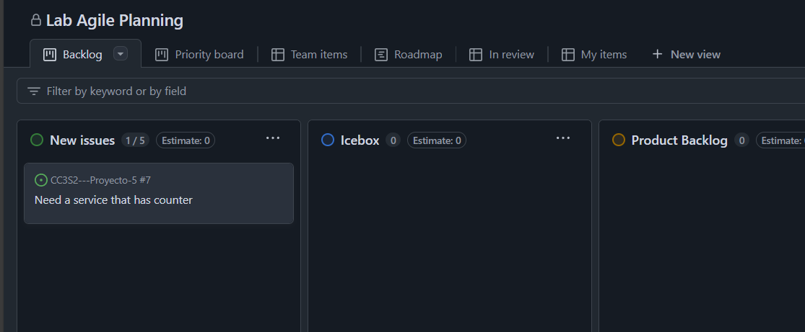  
  
10. Dado que debemos crear un total de siete historias de usuario, ajustemos el límite predeterminado a 7. Para lograr esto, haz clic en los tres puntos de la columna New Issues, luego selecciona la opción Set limit.
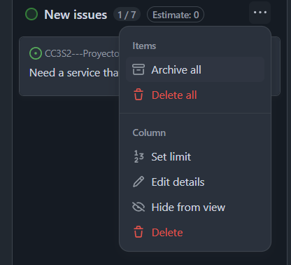  
  
11. Introduce el límite como 7 en el campo de texto Column limit y haz clic en Save. Ten en cuenta que, similar a esto, puedes optar por modificar los límites de otras columnas o mantener los límites predeterminados.  
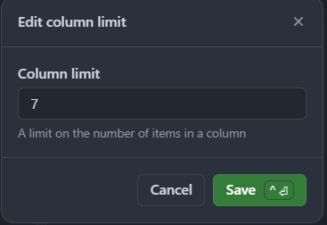
  
12. Para regresar a la pestaña Issues para crear nuevas historias de usuario, simplemente haz clic en el botón de retroceso del navegador.
