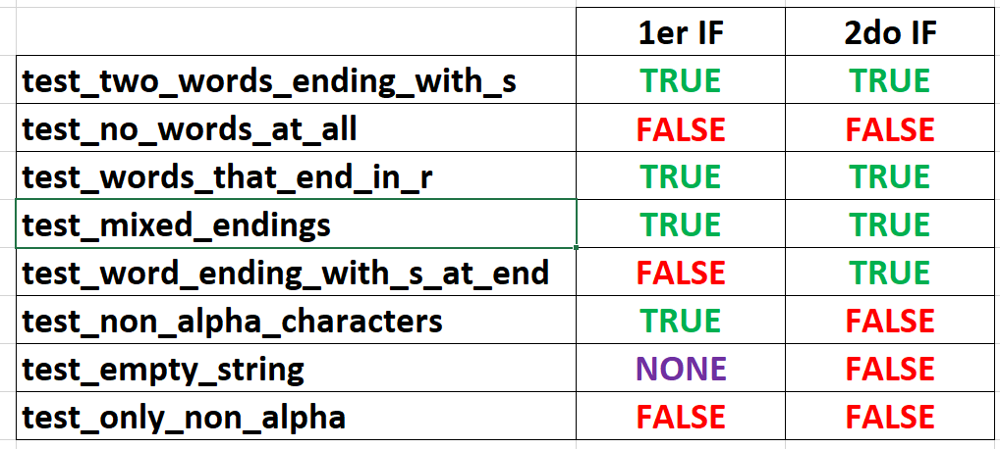
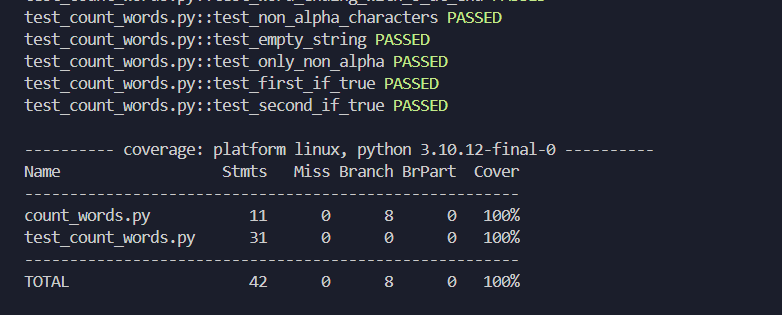
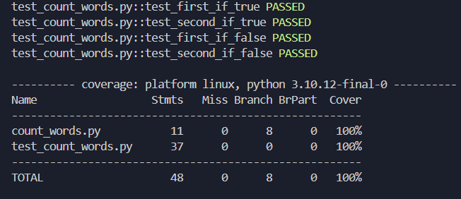
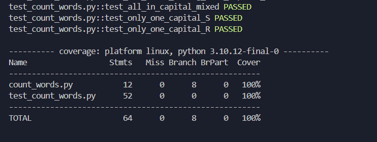

# EJERCICIO: AÑADIR COBERTURA DE RAMAS

### 1. Revisar los casos de Pruebas existentes

Código fuente:
```python
    class CountWords:
        def count(self, s: str) -> int:
            words = 0
            last = ' '

            for char in s:
                if not char.isalpha() and (last == 's' or last == 'r'):
                    words += 1
                last = char

            if last == 'r' or last == 's':
                words += 1 

            return words

```  
  
Y los casos de pruebas existentes son:
```python
# 1. IF true [V and (V or F)]
# 2. IF true [F or V]
def test_two_words_ending_with_s():
    words = CountWords().count("dogs cats")
    assert words == 2

# 1. IF false [V and (F or F)] 
# 2. IF false [F or F]
def test_no_words_at_all(): 
    words = CountWords().count("dog cat")
    assert words == 0

# 1. IF true [V and (F or V)] 
# 2. IF true [V or F]
def test_words_that_end_in_r():
    words = CountWords().count("car bar")
    assert words == 2

# 1. IF true [V and (F or V)] 
# 2. IF true [F or V]
def test_mixed_endings():
    words = CountWords().count("car cats")
    assert words == 2

# 1. IF false [F and (F or F)] 
# 2. IF True [F or V]
def test_word_ending_with_s_at_end():
    words = CountWords().count("cats")
    assert words == 1

# 1. IF True [V and (V or F)] 
# 2. IF False [F or F]
def test_non_alpha_characters():
    words = CountWords().count("dogs, cats.")
    assert words == 2

# 1. IF (no entra al bucle) 
# 2. IF false (F or F)
def test_empty_string():
    words = CountWords().count("")
    assert words == 0

# 1. IF false [V and (F or F))]
# 2. IF false [V or V]
def test_only_non_alpha():
    words = CountWords().count("!!!")
    assert words == 0
```  
  
Análisis de las Ramas para los test:  
  
  
  
### 2. Escribe al menos un caso de prueba adicional que cubra la rama donde el if es verdadero.

Añadimos dos test en donde los dos if son verdaderos  
```python
    # [V and (F or V)]
    def test_first_if_true():
        words = CountWords().count("daughter son")
        assert words == 1

    # [F or V]
    def test_second_if_true():
        words = CountWords().count("$&!/s")
        assert words == 1
```  
  
Resultado ejecutando `pytest -v --cov=./ --cov-branch`:  
  
   

### 3. Escribe otro caso de prueba que cubra la rama donde el if es falso.
  
Añadimos tests en donde los if son falsos  
  
```python
# [V and (F or F)]
def test_first_if_false():
    words = CountWords().count("silva quispe ravichagua")
    assert words == 0

# [F or F]
def test_second_if_false():
    words = CountWords().count("supabase")
    assert words == 0
```  
  
Resultado ejecutando `pytest -v --cov=./ --cov-branch`:  

  
  
### Casos de letras mayúsculas  
Para no excluir los casos de letras mayúsculas, modificamos el código de tal forma que el string sea siempre iterada en minuscula con la funcion `lower()`
```python
class CountWords:
    def count(self, s: str) -> int:
        words = 0
        last = ' '
        string = s.lower() #cambiar a minuscula

        for char in string:
            if not char.isalpha() and (last == 's' or last == 'r'):
                words += 1
            last = char

        if last == 'r' or last == 's':
            words += 1 

        return words
```   
  
Y añadimos los siguientes test:  
```python
def test_two_words_ending_with_capital_S():
    words = CountWords().count("DogS catS")
    assert words == 2

def test_one_words_ending_with_capital_S():
    words = CountWords().count("Dogs catS")
    assert words == 2

def test_all_in_capital_mixed():
    words = CountWords().count("CAR DOGS")
    assert words == 2

def test_only_one_capital_S():
    words = CountWords().count("CAt DOGS")
    assert words == 1

def test_only_one_capital_R():
    words = CountWords().count("CAr DOG")
    assert words == 1
```  
  
Resultado:  

