# Actividad: Explorando diferentes formas de fusionar en Git

## 1. Fusión Fast-forward (git merge --ff)  
La fusión fast-forward es la forma más simple de combinar ramas en Git. Solo es posible cuando la rama base no ha recibido nuevos commits desde que se creó la rama feature. 
### 1.1 Creamos un nuevo repositorio  
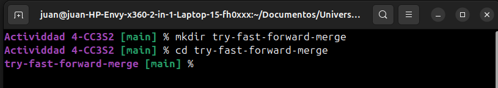  
  
### 1.2 Agregar un archivo inicial en la rama principal (main) 
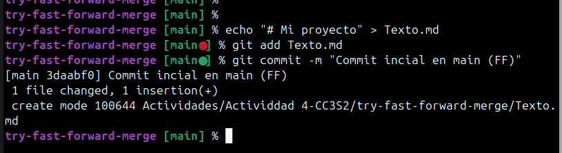  
  
### 1.3  Crear y cambiar a una nueva rama 'add-description'  
  
  
### 1.4 Hacer cambios en la nueva rama y comitearlos  
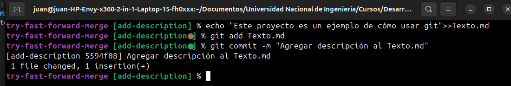  
  
### 1.5 Cambiar de vuelta a la rama 'main' y realizar la fusión fast-forward  
Para hacer dicha fusión se logra con un simple `git merge add-description`
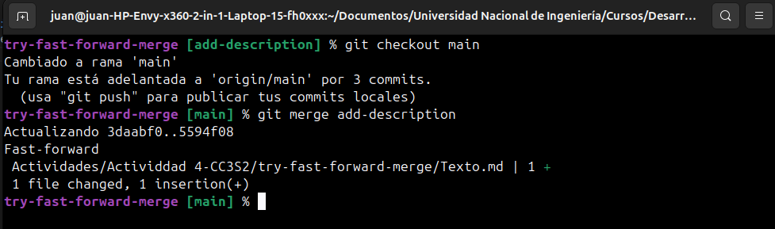  
  
Resultado en un git log seria tal que asi:  
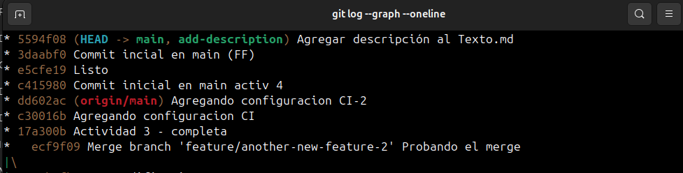  
Vemos que se mueve el puntero HEAD de la rama main al último commit de la rama de add-description. Como resultado, el historial de commits permanece lineal y
sin interrupciones.
  
## 2.  Fusión No-fast-forward (git merge --no-ff)  
La fusión no-fast-forward crea un nuevo commit de fusión. Es útil para preservar el contexto de la fusión, especialmente en equipos donde se requiere más claridad en el historial de cambios.  
  
### 2.1 Crear un nuevo repositorio  
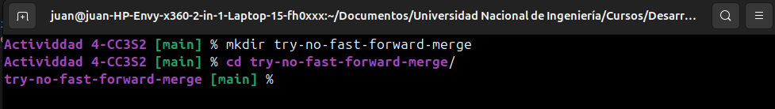  
  
### 2.2 Agregar un archivo inicial en la rama principal (main)  
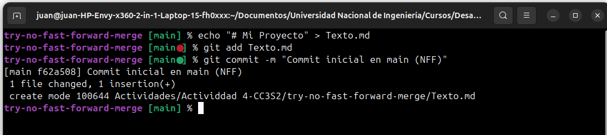  
  
### 2.3 Crear y cambiar a una nueva rama 'add-feature'  
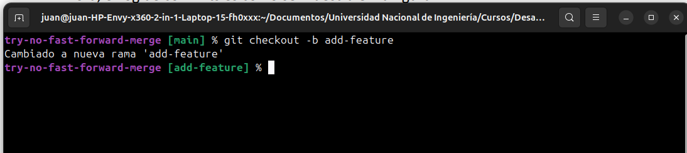  
  
### 2.4 Hacer cambios en la nueva rama y comitearlos  
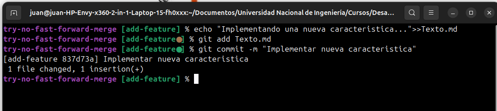  
  
### 2.5 Cambiar de vuelta a la rama 'main' y realizar una fusión no-fast-forward   
Esto se logra con el comando `git merge --no-ff add-feature` 
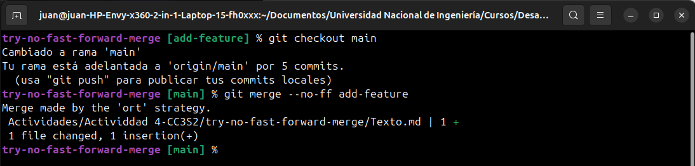  
  
Tener en cuenta que al momento de hacer el merge nos aparecará la opción de escribir el motivo de por qué la fusión, esto es el mensaje descriptivo del commit de fusión que se crea al hacer este tipo de merge, en este caso pusimos `Practicando git merge no-fast-forward`
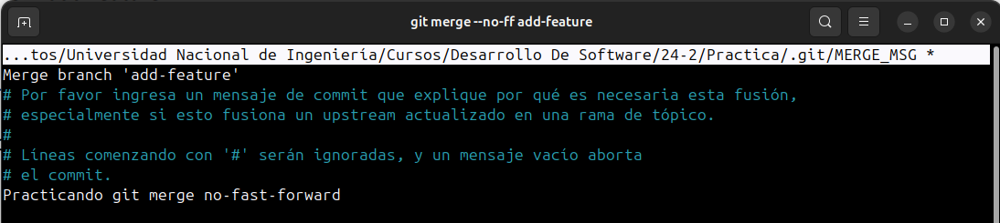 
  
Como resultado al mostrar los log en un gráfico, vemos que se creo un nuevo commit de fuscion (Merge branch) con el mensaje que pusimos
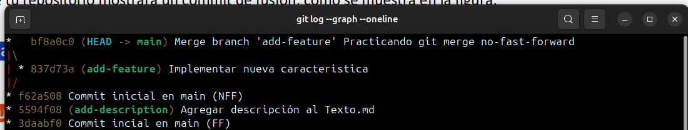  
  
## 3. Fusión squash (git merge --squash)  
La fusión squash combina todos los cambios de una rama en un solo commit en la rama principal. Este método es útil cuando se quiere mantener un historial de commits limpio.
  
### 3.1 Crear un nuevo repositorio  
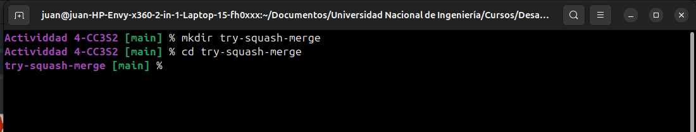  
  
### 3.2 Agregar un archivo inicial en la rama principal (main)  
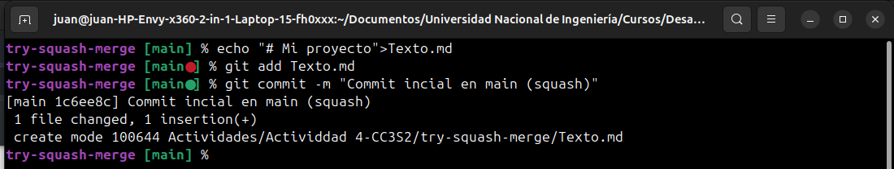  
  
### 3.3 Crear y cambiar a una nueva rama 'add-basic-files'  
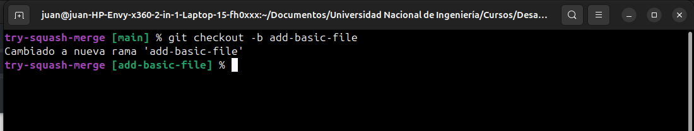  
  
### 3.4 Hacer algunos cambios y comitearlos  
Primero añadimos un CONTRIBUTING.md y lo comiteamos
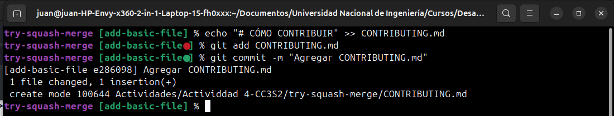  
  
Luego añadimos otro archivo LICENSE.txty lo comiteamos, entonces en total tendriamos 2 commit hechos en la ramma add-basic-file   
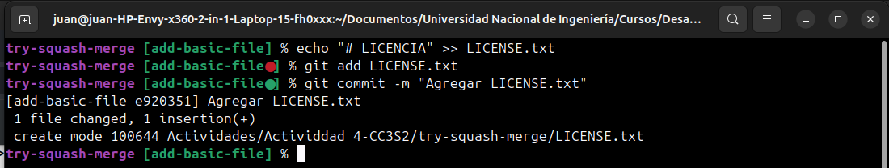
  
### 3.5 Cambiar de vuelta a la rama 'main' y realizar la fusión squash  
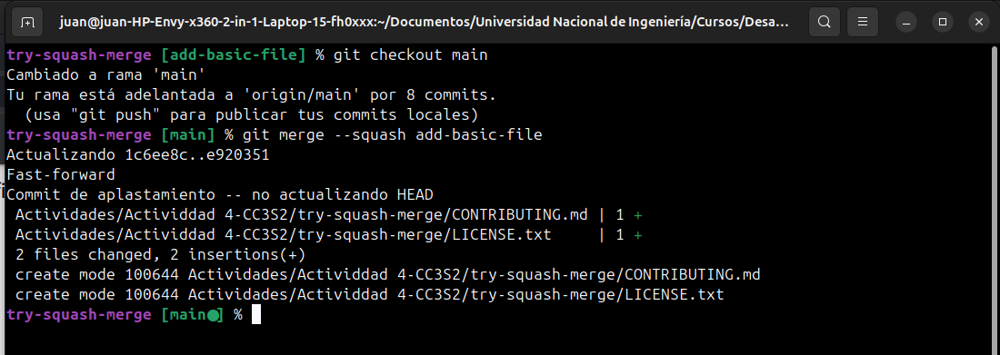  
    
Los dos commit hechos en la rama add-basic-file se han aplasado en un solo commit y esta puesto en un la rama main, Git no crea automáticamente un commit en la rama main,  porque te permite modificar el mensaje del commit o ajustar el contenido antes de guardarlo.  
Recuerda: un merge squash sólo prepara los cambios pero no los guarda de forma permanente hasta que hagas un commit explícito en la rama objetivo.   
  

### 3.6 Para completar la fusión squash, realiza un commit:  
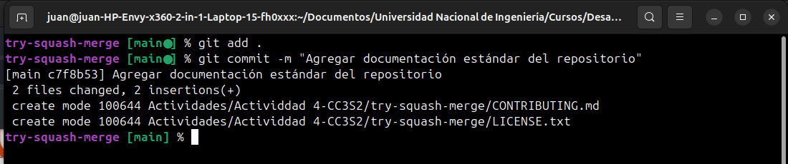  
  
El resultado:  
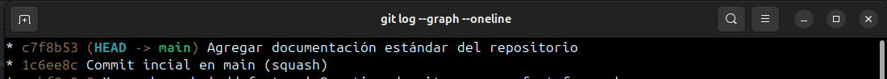