# Ejercicio 1  
## 1. Estructura del proyecto  
  
Creamos la estructura del proyecto acorde a las indicaciones  
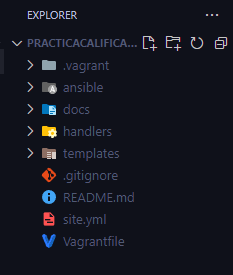  
  
## 2. Creamos el VagrantFile  
Usando el comando `vagrant init ubuntu/focal64` creamos un archivo Vagrantfile para una máquina Ubuntu  

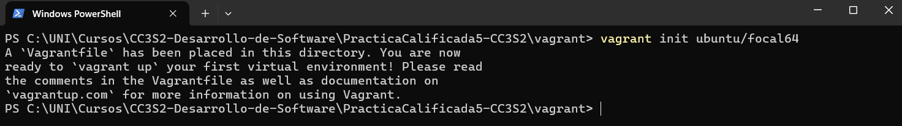  
  

Editamos el vagrantfile de tal forma que la red sea privada con IP estática (linea 77), 2GM de ram para la VM (con nombre vm_pc5 en la linea 80) y que esté provisionada por el playbook site.yml (linea 85)

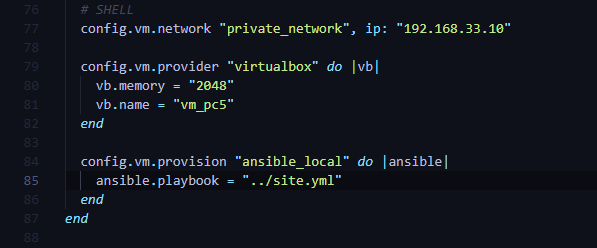  
  
## 3. Escribir el playbook site.yml  
Especificaamos en el site.yml que tareas se ejecutarán para el aprovisionamiento de la VM
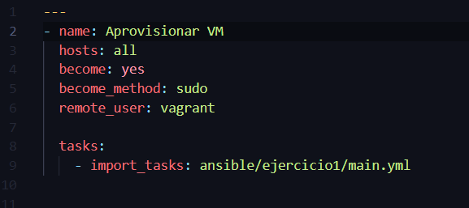
  
## 4. Creación de las tareas de main.yml  
Cremaos 5 tareas:  
- Tarea 1: actualizamos el sistema con ayuda de `upgarde: dist`  
- Tarea 2: cambiamos la zona horaria a UTC 
- Tarea 3: se crea un grupo con nombre `admin`  
- Tarea 4: creamos un usuario `devuser` con una constraseña cifrada y se le asgina un bash como shell  
- Tarea 5: Al usuario devuser le asignamos el grupo creado previamente (admin)  

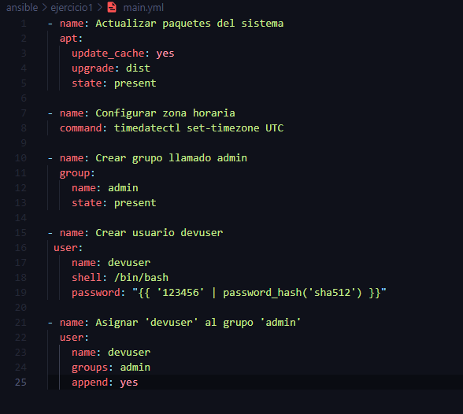
  
## 5. Ejecución:  
Ejecutamos con el comando `vagrant up` y con esto se levantará la VM y se ejecutarán las tareas descritas.  
  
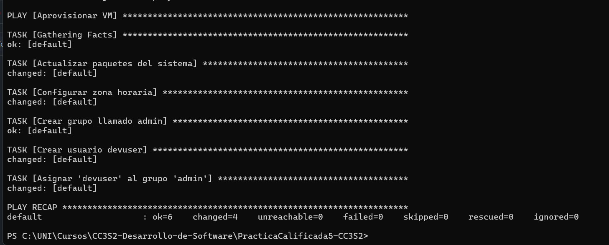  
  
Nos conectamos con `vagrant ssh` y verificamos si el usuario `devuser` existe y pertenece al grupo `admin`, para ello usamos los comandos  
  
Verificación del usuario devuser:
```bash
    cat /etc/passwd | grep devuser
```  
  
  
Verificacion de la existencia del grupo admin:
```bash
    cat /etc/group | grep admin
```  
  
Verificacion del grupo de devuser  

```bash
    groups devuser
```  

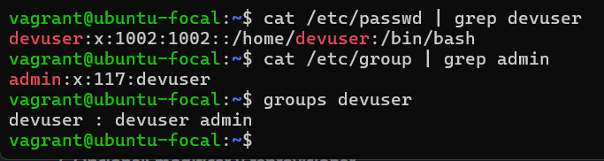  
  
# Ejercicio 2  
  
## Actualización site.yml  
Agregamos la importanción ansible/ejercicio2/main.yml  (linea 10)
  
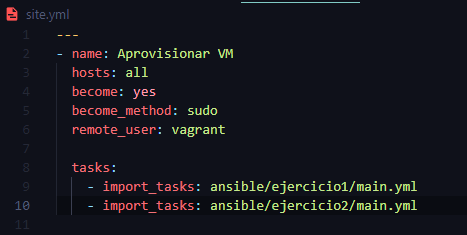  
  
## Crear el main.yml del ejercicio 2   
Implementamos las tareas en el main.yml  
  
- Tarea 1: Instalamos el server nginx  
- Tarea 2: Crearmos un directorio /etc/nginx/ssl para almacenar los certificados SSL  
- Tarea 3: Ejecutamos un comando openssl para crear un certificado SSL autofirmado válido por 365 días  
- Tarea 4:  Se copia una plantilla de configuración desde el archivo `config_plantilla.j2`  
- Tarea 5: Configuramos el firewall UFW para permitir tráfico entrante en los puertos 80 y 443
  
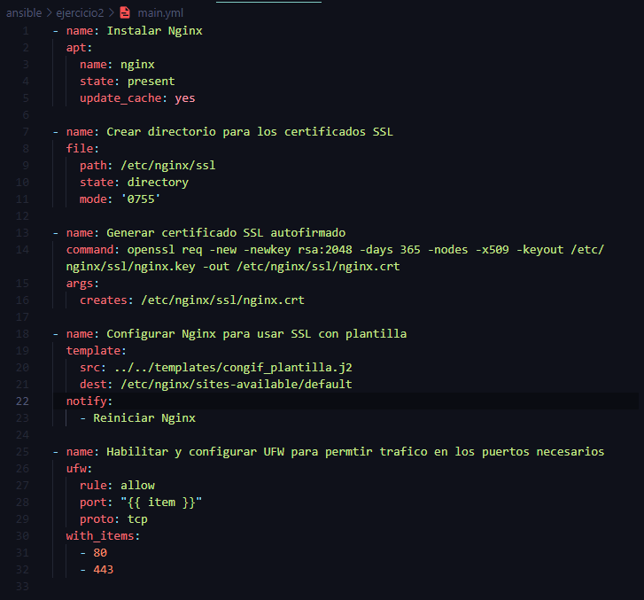  
  
## Crear el manejador en handlers/main.yml  
Dicho manejador tiene la tarea de reiniciar el nginx 

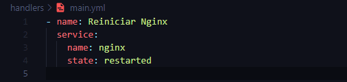  
  
## Crear plantilla de configuracion de Nginx  
Creamos una plantilla que define como el servidor manejará las conexiones HTTPS utilizando SSL, además de servir contenido estático en `/var/www/html`  

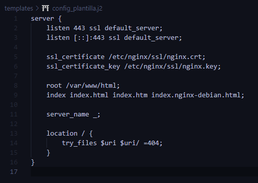
  
    
  
# Ejercicio 3  
## Actualizar site.yml  
  
Modificamos el site.yml importando el main.yml de la actividad 3  

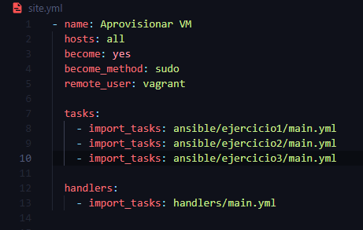  
  
## Crear el main.yml  
Aqui ejecutaremos algunas tareas como:  
- Tarea 1: Insalacion de python3 y pip  
- Tarea 2: Instalacion de flask y gunicorn  
- Tarea 3: Crea el directorio `/var/www/app_con_flask` con algunos permisos para almacenar la aplicación Flask  
- Tarea 4: Usamos una plantilla para generar y colocar el archivo principal de la aplicación Flask (app.py) en el directorio creado anteriormente  
- Tarea 5: Generamos una plantilla para configurar un servicio systemd dinamico que ejecute Flask y Gunicorn  
- Tarea 6: Habilitamps los servicios en los puertos 5000 y 5001  
- Tarea 7: Usamos una plantilla para configurar Nginx como balanceador de cargas  
- Tarea 8: Se crea un enlace simbólico para habilitar la configuración de Nginx recién creada

```yml
- name: Instalar dependencias de Python
  apt:
    name: 
      - python3
      - python3-pip
    state: present
    update_cache: yes

- name: Instalar Flask y Gunicorn
  pip:
    name: 
      - flask
      - gunicorn

- name: Crear directorio para la aplicacion Flask
  file:
    path: /var/www/app_con_flask
    state: directory
    mode: '0755'

- name: Copiar la aplicación Flask
  template:
    src: ../../templates/app_con_flask.py.j2
    dest: /var/www/app_con_flask/app.py
    mode: '0644'

- name: Crear servicios systemd para las instancias de Flask
  template:
    src: ../../templates/app_con_flask@.service.j2
    dest: /etc/systemd/system/app_con_flask@.service
    mode: '0644'

- name: Habilitar e iniciar servicios Flask en puerto 5000 y 5001
  command: systemctl enable --now app_con_flask@{{ item }}
  with_items:
    - 5000
    - 5001

- name: Configurar Nginx como balanceador de carga
  template:
    src: ../../templates/balanceador.j2
    dest: /etc/nginx/sites-available/app_con_flask
  notify:
    - Reiniciar Nginx

- name: Habilitar configuracioo de Nginx
  file:
    src: /etc/nginx/sites-available/app_con_flask
    dest: /etc/nginx/sites-enabled/app_con_flask
    state: link
  notify:
    - Reiniciar Nginx
```  
  
## Plantillas  
Esta es la plantilla para la aplicación de flask  

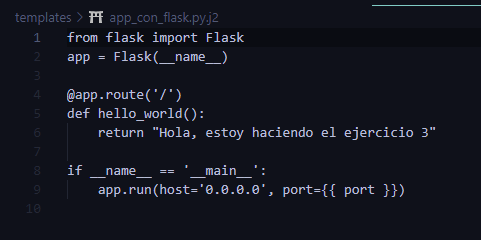  

Plantilla para los servicios systemd  

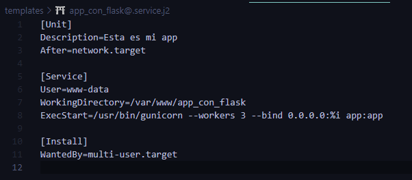 

  
Plantilla para la configuracion de Nginx para balanceo de carga
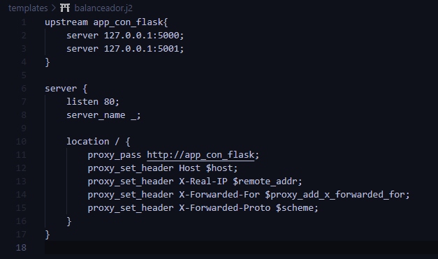  
  
  
    
# Ejercicio 4  
## Actualizamos el site.yml  
Modificamos el site.yml añadiendo la importación del main.yml del ejercicio 4
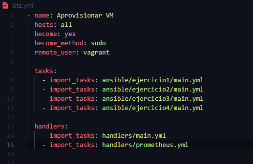  
  
## Creacion del main.yml  
Implementamos las siguientes tareas:  
- Tarea 1: Se installa el prometheus y el node Exporter    
- Tarea 2: Copiamos una plantilla a `/etc/prometheus/prometheus.yml`  
- Tarea 3: Se instala grafana  
- Tarea 4: Con ayuda del módulo service habilitamos el grafana en el arranque del sistema  


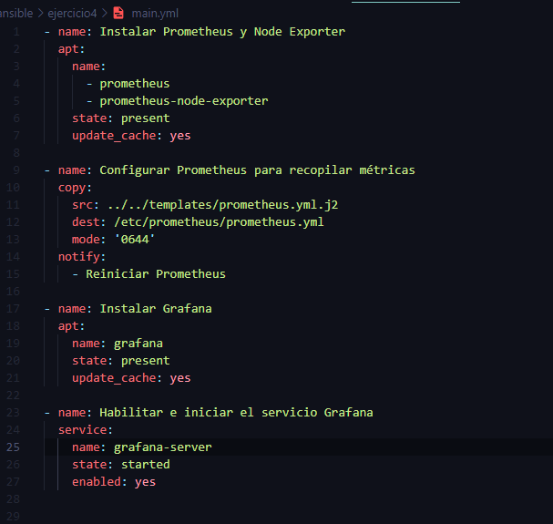  
  
## Manejador  
Manejador para reniciar prometheus  

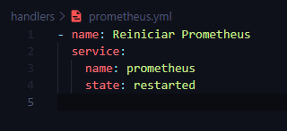  
  
## Plantilla  
Este archivo configura Prometheus para recopilar métricas cada 15 segundos y evalúa reglas en el mismo intervalo. Define tres trabajos: monitorear Prometheus en el puerto 9090, Node Exporter en el puerto 9100, y una aplicación Flask en los puertos 8000, 5000 y 5001  

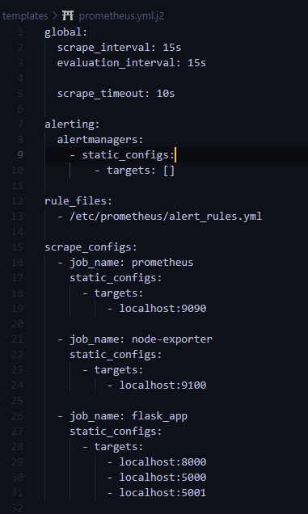